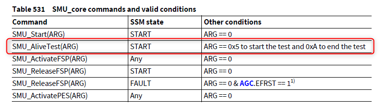

# ALIVE_ALARM_TEST

> Source: /spaces/CARSFW/pages/2832087132/ALIVE_ALARM_TEST
> Last modified: 2023-03-13T08:54:18.000+01:00

---

### Overview

The Application SW shall, at least once per driving cycle, test the SMU core alive monitor and its connection to the SMU standby by triggering the alive alarm using SMU_AliveTest() command as described in the user manual

StartupPhase3 in Start up code performs the Alive Alarm Test of SMU module

Below command is used to test this ESM

No Configuration required for this ESM from project side

