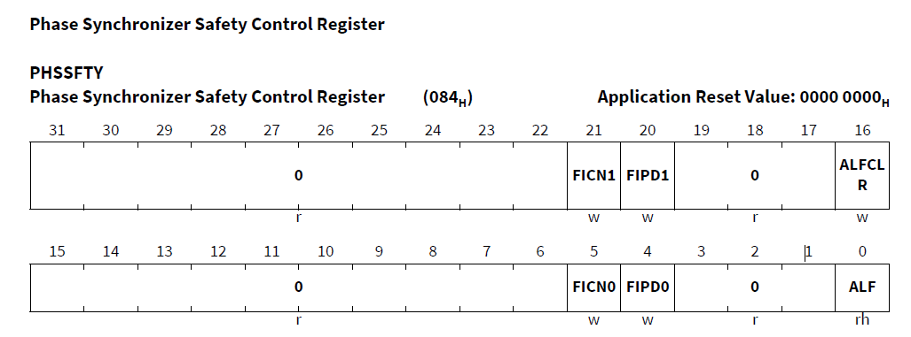

# PHASE_SYNC_ERR

> Source: /spaces/CARSFW/pages/2831577242/PHASE_SYNC_ERR
> Last modified: 2023-03-14T07:22:10.000+01:00

---

The Safety Mechanism supervises the operation of the Phase Synchronizer by monitoring the parity bit of its prescaler (PHSCFG.PHSDIV) and the counter value

> **INFO: AUSS**
> This Self Test is done by AUSS (Auris Safety Startup) module not by Start up code

### Converter Control Block (CONVCTRL)

The converter control block summarizes control functions which are common for all converters implemented in the product. The following functions are provided:

- Phase Synchronizer (PhSync) - The phase synchronizer provides a specific clock enable signal to synchronize the operation of all analog blocks within modules EVADC and EDSADC. These analog blocks use the voltage references (VAREF and VAGND) and synchronizing their clock edges avoids performance losses caused by mutual cross-coupling via the reference lines

#### Safety Measures

Since the Phase Synchronizer influences all analog-digital-converters, safety measures are implemented to supervise its operation and, as a consequence, the operability of the converters

##### Parity-Protection of the Prescaler Value

The additional parity bit helps to detect a corrupted prescaler value, which would result in the wrong synchronization frequency for the converters. The parity bit is generated automatically when writing to bitfield PHSDIV. Parity is then checked constantly

##### Run-Time Supervision of the Counter

Two counters are counting in parallel. Their states are constantly compared and a difference triggers an alarm event

##### Alarm-Event Signaling

If an alarm event is triggered it sets the sticky alarm flag and activates the alarm output signal. The output signal is connected to the SMU.

##### Fault Injection

To test the supervision mechanism, the application software can deliberately inject a fault condition into both mechanisms. This is accomplished by writing a 0 to bit FIPD0/FICN0 and writing a 1 to bit FIPD1/FICN1 at the same time. Bits FIPDi trigger a fault condition in the supervision logic of bitfield PHSDIV, bits FICNi trigger a fault condition in the supervision logic of the phase sync counter

