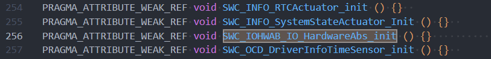
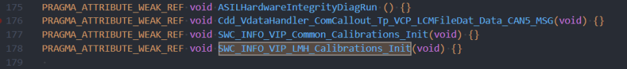
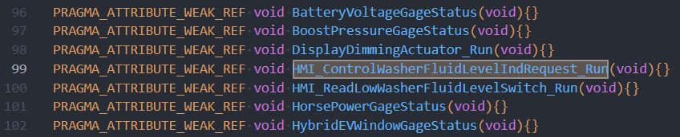
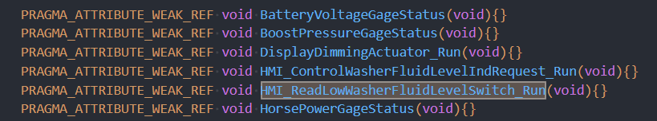

# IoHwAb_Module

> Source: /spaces/CARSFW/pages/4580994111/IoHwAb_Module
> Last modified: 2024-09-02T11:33:44.000+02:00

---

|   |   |   |
| --- | --- | --- |
| 模块名 | 描述 | 相关代码路径 |
| IOHWAB | 提供了很多IoHwAb_Set* /IoHwAb_Get* server类型的RTE接口 | .\vcu\vip\f1kh\autosar\VIP_Target_Bosch\src\platform_src\PlatformGm\IOHWAB\src .\vcu\vip\f1kh\autosar\VIP_Cfg_Bosch\vector_bsw_clea_cfg\Stubs\Autosar\Stubs_A1.c (server 接口函数实现) .\vcu\vip\f1kh\autosar\VIP_Cfg_Bosch\vector_bsw_clea_cfg\Stubs\Autosar\IOHWAB.c (server 接口函数实现) |
| SWC_IOHWAB_IO_HardwareAbs | 提供了一些server 类型的RTE接口 | .\vcu\vip\f1kh\autosar\VIP_Cfg_Bosch\vector_bsw_clea_cfg\Stubs\Application\Appl_Stubs.c (developer配置接口函数实现路径) |
| SWC_INFO_VIP_LMH_Calibrations | 提供了一些server 类型的RTE接口 | .\vcu\vip\f1kh\autosar\VIP_Cfg_Bosch\vector_bsw_clea_cfg\Stubs\Autosar\Stubs_A1.c (developer配置接口函数实现路径) |
| SWC_OCD_WasherFluidLevelSwitch | 提供了两个周期类型的runnable函数 | .\vcu\vip\f1kh\autosar\VIP_Cfg_Bosch\vector_bsw_clea_cfg\Stubs\Autosar\Stubs_A1.c (developer配置接口函数实现路径) |

1. IoHwAb模块

路径： .\vcu\vip\f1kh\autosar\VIP_Target_Bosch\src\platform_src\PlatformGm\IOHWAB\src IoHwAb

|   |   |
| --- | --- |
| Source Name | Description |
| IoHwAb.c | 提供一些IoHw接口，与Dio, Adc, Sensor, Display外设交互 |
| IoHwAb_ADC_MCAL.c | 提供接口，获取adc通道的采样值 |
| IOHWAB_Amplifier.c | 提供接口，对amplifier进行初始化和状态控制 |
| IoHwAb_AncMic.c | 提供接口，GetMicrophoneFaultStatus |
| IoHwAb_CD.c | 向诊断提供接口, 读DiagnosticAddress, UniversalNumberingSystemId等信息 |
| IoHwAb_Dio_Read.c | 提供接口，读IO口 |
| IoHwAb_Dio_Write.c | 提供接口，写IO口 |
| IoHwAb_DltLog.c | ContextId=IOHA的DLT打印接口 |
| IoHwAb_DLTlog_CLEA.c | DLT接口周期打印Acc和Crank状态 |
| IoHwAb_EcuInternalAwakeHandler.c | 监控DebugWakeupButton press/release，并打印log |
| IoHwAb_ErrorAndTrace.c | 提供DLT注入接口，用于DLT命令测试 |
| IoHwAb_GEM.c | 提供接口读/写IO状态 |
| IoHwAb_IOSignalInterface.c | 提供接口，读DebugWakeupButton状态 |
| IoHwAb_LEDCtrl.c | 提供接口，读LED control电路故障状态 |
| IoHwAb_Mic.c | 提供接口，Get Mic 状态 |
| IoHwAb_PVTest.c | 提供接口读/写IO状态 |
| IoHwAb_Pwm.c | Set PWM frequency for diag |
| IoHwAb_RTC.c | 提供接口Set/Get RTC Alarm/Time |
| IoHwAb_Security.c | 提供接口获取ECUID，BootInfo信息 |
| IoHwAb_SSH.c | GetHWIntegrityStatus，没有使用 |
| IoHwAb_SWUpdate.c | Get/Set ReflashActiveFlag，没有被调用 |
| IoHwAb_Thermal.c | 提供一些接口，获取温度传感器AD值，提供Set 风扇风速接口 |

部分函数描述如下： void IoHwAb_Init(const IOHWAB_FeatureSetconfiguration_t *IOHWAB_currentVariant_pst) 通过函数入参，给全局变量IOHWAB_AdcDio_pst赋值，这个变量包含很多bit，根据不同的variant，bit中的值不同。

Std_ReturnType IoHwAb_GetGlowPlug(TeGlowPlug *GetGlowPlug) 读IoHwAb_DioRead_EXT_IO_GLOW_PLUG 电平

Std_ReturnType IoHwAb_SetRevSig(TeRevSigEn RevSigEn) 写IoHwAb_DioWrite_SCC_CPU_CTRL_REVERSE_GEAR 电平

Std_ReturnType IoHwAb_GetRevSigStatus(TeRevSigEn *RevSigEn) 读IoHwAb_DioRead_SCC_CPU_CTRL_REVERSE_GEAR 电平 FUNC(Std_ReturnType, IoHwAb_CODE) IoHwAb_GetBatteryVoltage( P2VAR(uint32, AUTOMATIC, RTE_IOHWAB_APPL_VAR) BatteryVoltageLevel ) 获取电池电压，中间AD 会经过滤波，然后转换成mv，然后再转换成真实电压，单位是v，并将电压值写入函数入参指针中。

Std_ReturnType IoHwAb_WLANANTSRPortshorttoGnd(boolean *pu8WLANDiagShorttoGrd) 读wifi天线状态，如果读到的电压AD<810, 接口返回true. 否则的话，接口返回false

Std_ReturnType IoHwAb_WLANANTSRPortOpenCkt(boolean *pu8WLANDiagOpenCkt) 读wifi天线状态，如果读到的电压AD>=3300, 接口返回true，否则的话，接口返回false

static uint32 IoHwAb_GetTimestamp(void) 获取timer 运行了多长时间

.\vcu\vip\f1kh\autosar\VIP_Cfg_Bosch\vector_bsw_clea_cfg\Stubs\Autosar\Stubs_A1.c 提供很多空的SWC接口，可能是解决编译报错

2. SWC_IOHWAB_IO_HardwareAbs模块

SWC_IOHWAB_IO_HardwareAbs RTE server函数实现文件路径 .\vcu\vip\f1kh\autosar\VIP_Cfg_Bosch\vector_bsw_clea_cfg\Stubs\Application\Appl_Stubs.c

|   |   |
| --- | --- |
| Function Name | Implement |
| FUNC(void, SWC_IOHWAB_IO_HardwareAbs_CODE) SWC_IOHWAB_IO_HardwareAbs_init(void); |  |

3. SWC_INFO_VIP_LMH_Calibrations模块

SWC_INFO_VIP_LMH_Calibrations RTE server函数实现文件路径 .\vcu\vip\f1kh\autosar\VIP_Cfg_Bosch\vector_bsw_clea_cfg\Stubs\Autosar\Stubs_A1.c

|   |   |
| --- | --- |
| Function Name | Implement |
| FUNC(void, SWC_INFO_VIP_LMH_Calibrations_CODE) LMH_Calibrations(void); | 没有函数定义 |
| FUNC(void, SWC_INFO_VIP_LMH_Calibrations_CODE) SWC_INFO_VIP_LMH_Calibrations_Init(void); |  |

4. SWC_OCD_WasherFluidLevelSwitch模块

SWC_OCD_WasherFluidLevelSwitch RTE server函数实现文件路径 .\vcu\vip\f1kh\autosar\VIP_Cfg_Bosch\vector_bsw_clea_cfg\Stubs\Autosar\Stubs_A1.c

|   |   |
| --- | --- |
| Function Name | Implement |
| FUNC(void, SWC_OCD_WasherFluidLevelSwitch_CODE) HMI_ControlWasherFluidLevelIndRequest_Run(void); |  |
| FUNC(void, SWC_OCD_WasherFluidLevelSwitch_CODE) HMI_ReadLowWasherFluidLevelSwitch_Run(void); |  |
