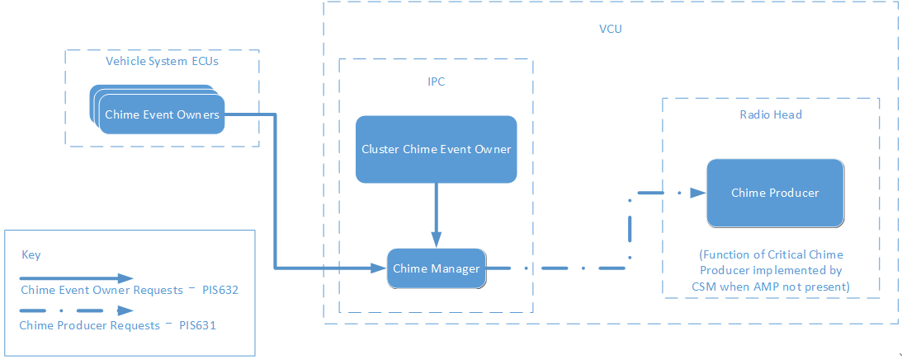
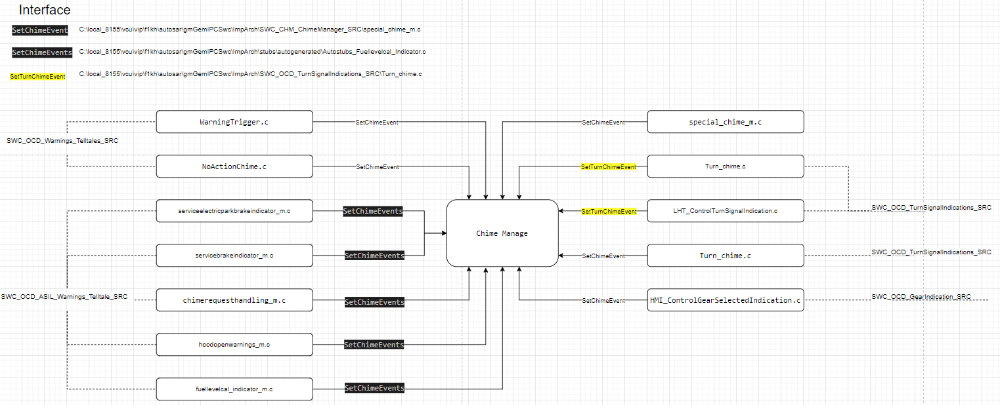

# SWC_CHM_ChimeManager_SRC

> Source: /spaces/CARSFW/pages/4677105565/SWC_CHM_ChimeManager_SRC
> Last modified: 2024-09-05T08:10:53.000+02:00

---

## 1. Overall

A service with the task of commanding the next active, highest priority chime event ID to the Chime Producer. The Chime Manager also provides a status of the chime subsystem to the functions within the vehicle that own chime events.

## 2. Chime System

## 3. Files

| file name | description | Comment |
| --- | --- | --- |
| chimemanager_initialize_m.c | Initialize the variables |  |
| chimemanager_run_m.c | chime manage and basic process |  |
| playipcchime1actionhandler_m.c … playipcchime"n"actionhandler_m.c | Set event state as ACTIVE, and reset relate action timer value |  |
| special_chime_m.c | special chime event process |  |
| stopipcchime2actionhandler_m.c … stopipcchime"n"actionhandler_m.c | Set event state as CANCEL_CHIME, and reset relate action timer value |  |
| swc_chm_chimemanager_variables.c | define the variables used in chime manage |  |
| timer_util.c | Chime timer process for some chime event. |  |
| CleakModId9.c | define the priority of Chime Event. |  |

## 4. Interface

| Interface | Call | Comment | Define path |
| --- | --- | --- | --- |
| SetChimeEvent | SWC_CHM_ChimeManager_SRC |  | local_8155\vcu\vip\f1kh\autosar\gmGemIPCSwc\ImpArch\SWC_CHM_ChimeManager_SRC\special_chime_m.c |
| SetChimeEvents | SWC_OCD_ASIL_Warnings_Telltale_SRC |  | C:\local_8155\vcu\vip\f1kh\autosar\gmGemIPCSwc\ImpArch\SWC_OCD_ASIL_Warnings_Telltale_SRC\chimerequesthandling_m.c |
| SetTurnChimeEvent | SWC_OCD_TurnSignalIndications_SRC |  | local_8155\vcu\vip\f1kh\autosar\gmGemIPCSwc\ImpArch\SWC_OCD_TurnSignalIndications_SRC\Turn_chime.c |
| ChimeManager_Run | 25ms Task |  | local_8155\vcu\vip\f1kh\autosar\gmGemIPCSwc\ImpArch\SWC_CHM_ChimeManager_SRC\chimemanager_run_m.c |

## 5. Data Struct

|   |   |   |   |
| --- | --- | --- | --- |
| Type | Variables | Description | Comment |
| uint16 | g_u16CurrentActiveChimeID; | current active chime ID |  |
| uint16 | g_u16PrevChimeManagerStatus; | previous chime manager status |  |
| uint16 | g_u16ChimeProducerStatus; | chime producer status |  |
| uint16 | g_u16PrevChimeProducerStatus; | previous chime producer status |  |
| uint8 | g_u8CurrentActiveChimePriority; | currentious active chime priority |  |
| uint8 | g_u8ChimeProducerRequestReqToSend; | chimeious producer request req to send |  |
| uint8 | g_u8ChimeProducerRequestHoldTimer; | chimeious producer request hold timer |  |
| uint8 | g_u8ChimeProducerRequestNoActionTimer; | chimeious producer request no action timer |  |
| uint8 | g_u16ChimeManagerSOHHoldTimer; | chimeious manager sohhold timer |  |
| uint8 | g_u16ChimeSystemSOHPwrModeTimer; | chimeious system sohpwr mode timer |  |
| uint8 | g_au8IPCChimeNoActionTimer[76]; | ipcchimeious no action timer |  |
| uint32 | g_u32ChimeManagerGenPurposeFlags; | chimeious manager gen purpose flags |  |
| uint8 | g_u8PreviousVehiclePowerMode; | previousious vehicle power mode |  |
| uint8 | g_u8PreviousParkAssistRegion; | previousious park assist region |  |
| uint16 | g_u16PlayCompletedChimeID; | playious completed chime ID |  |
| uint16 | g_u16PrevRequestedChimeID; | previous requested chime ID |  |

## 6. Functions

|   |   |   |   |
| --- | --- | --- | --- |
| Files | Functions | Description | Comment |
| chimemanager_initialize_m.c | ChimeManager_Initialize |  |  |
| chimemanager_run_m.c | ChimeManager_Run | Run chime manager |  |
| DecideChimeManagerStatus | Get Chime manager status |  |
| DecideChimeProducerStatus | Get Chime producer status |  |
| DecideChimeRequestUpdate | Process chime request logic, and set chime producer request hold timer |  |
| CheckAndArbitrateSignal | check and arbitrate the chime event signal, and select the next chime event |  |
| CheckAllChimeEvents | check and arbitrate the chime event signal, and select the next chime event |  |
| HandleChimeSystemSOH | Handle the state of health for Chime system |  |
| HandleLaneFollowingChimes | Handle lane following chime event |  |
| CheckCriticalChimeStatus | Check critical chime status, and Set chime pending status true/false |  |
| HandleNoActionIPCChimeEvents | Process chime event action timer |  |
| ArbitrateAllSideClosureChimes |  |  |
| playipcchime1actionhandler_m.c … playipcchime"n"actionhandler_m.c | PlayIPCChime"n"ActionHandler | set chime event "n" status to "ACTIVE" and set chime action timer value |  |
| special_chime_m.c | get_g_u8EPBRequested2 | Get EPB request |  |
| Specialchime_Run | Run special chime |  |
| EngineDamageNotification | engine damage notification |  |
| EPBWarningNotification | EPB(Electrical Park Brake) warning notification |  |
| HybridDoorAjarNotification | hybrid door ajar notification |  |
| ManualParkBrakeNotification | manual park brake notification |  |
| RetrySpeChime | retry special chime 2600 |  |
| RetrySpeChime735 | retry special chime 735 |  |
| NoActionSpeChime | process noaction for special chime |  |
| Specialchime_Initialize | Initialize the special chime |  |
| SetChimeEvent | set chime event status |  |
| stopipcchime2actionhandler_m.c … stopipcchime"n"actionhandler_m.c | StopIPCChime"n"ActionHandler | set chime event "n" status to "CANCEL_CHIME" and set chime action timer value |  |
| swc_chm_chimemanager_variables.c | NULL | define the chime manage variables |  |
| timer_util.c | Chime_Timer_Start | start chime timer |  |
| Chime_Timer_Stop | stop chime timer |  |
| Chime_Timer_Reset | reset(stop and start) the chime timer |  |
| reset_retryCount2600 | reset retry count for special chime ID 2600 |  |
| reset_retryCount735 | reset retry count for special chime ID 735 |  |
| Chime_Timer_Expired | chime timer expire process for special chime |  |
| CleakModId9.c | NULL | chime event priority |  |

## 7. Questions

### 7.1. Chime event ID is priority?

### 7.2. The Chime ID in Interface SetChimeEvent、SetChimeEvents、SetTurnChimeEvent are not full version,

## 8. Requirements

### 8.1. PIS-631 Appendix_CLEA Chime Database_MY25_05-13-24.xlsx

### 8.2. PIS-631 Clea Family Chime Producer Interface Specifiction V3.6_2024.05.13.doc

### 8.3. PIS-632 Clea Family Chime Manager Interface Specification V1.1 - review patac&bosch in 20240801.doc

### 8.4. regulatory_safety_critical_CLEA Chime Database_0227 2.xlsx

PIS-631 Appendix_CLEA Ch… PIS-631 Clea Family Chim… PIS-632 Clea Family Chim… regulatory_safety_critic…
