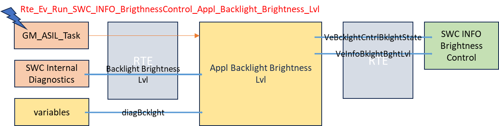
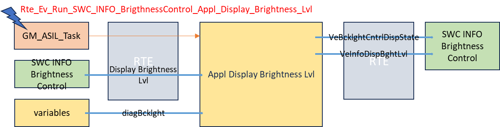
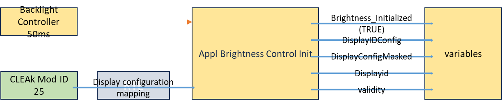
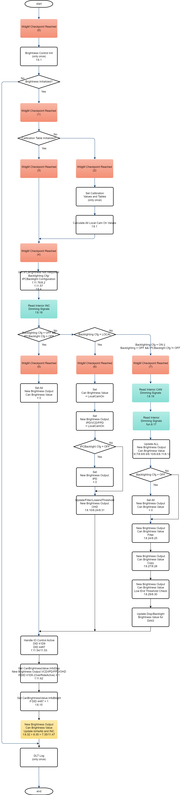

# SWC_INFO_BrigthnessControl_SRC

> Source: /spaces/CARSFW/pages/4605628552/SWC_INFO_BrigthnessControl_SRC
> Last modified: 2024-09-05T11:25:22.000+02:00

---

Table, global variables and function lists.

| Index | Source Code | Variables | Comment |
| --- | --- | --- | --- |
| 1 | SWC_INFO_BrigthnessControl_Variables.c | 1. const uint8 DisplayConfig[47][6] 2. uint8 dim_change_allowed; 3. boolean is_set_display_off_active; 4. boolean tlinNeedsRetry; 5. uint8 BklghtngCnfg; 6. uint8 IPCBacklightConfiguration; 7. uint8 Prev_IPCBacklightConfiguration; 8. uint8 DeadFrntSwtchIllumLvl; 9. uint8 InfoSystemState; -------------------------------------------------- 10. uint8 IntDimDspLevel; 11. uint8 IntDimLevel; -------------------------------------------------- 12. uint16 lagFilterCo; 13. uint16 ipdlagFilterCo; 14. uint16 OhdlagFilterCo; 15. uint16 FpdlagFilterCo; 16. BrightnessOutput PrevFilterBrightness; 17. boolean Brightness_Initialized; 18. boolean PerformDspDimLvlFailsofting; 19. boolean PerformIntDimLvlFailsofting; 20. boolean PerformIncDimLvlFailsofting; 21. boolean PerformCanDimLvlFailsofting; 22. boolean PerformDFSIllumLvlFailsofting; 23. uint8 Prev_BklghtngCnfg; 23. boolean StorageLockStatus; 24. BrightnessOutput PrevBrightnessOutput; -------------------------------------------------- 25. uint16 diagBcklght; 26. uint16 diagDisp; -------------------------------------------------- 27. const uint8 *ControlInputTablePtr; 28. const uint16 *ControlOutputTablePtr; 29. const uint8 *DisplayInputTablePtr_Day; 20. const uint16 *DisplayOutputTablePtr_Day; 21. const uint8 *DisplayInputTablePtr_Night; 22. const uint16 *DisplayOutputTablePtr_Night; 23. const uint8 *IndicatorInputTablePtr; 24. const uint16 *IndicatorOutputTablePtr; 25. const uint8 *IPCDisplayInputTablePtr_Day; 26. const uint16 *IPCDisplayOutputTablePtr_Day; 27. const uint8 *IPCDisplayInputTablePtr_Night; 28. const uint16 *IPCDisplayOutputTablePtr_Night; -------------------------------------------------- 29. uint16  LowEndThresh; 30. uint16  IPDlowthreshold; 31. uint16  minbrght; 32. uint16  IPDminbrght; 33.  uint16  FPDminbrght; 34. uint16  OHDminbrght; -------------------------------------------------- 35. uint16 LagFilter; 36. uint16 IPDLagFilter; 37. uint16 FPDLagFilter; 38. uint16 OHDLagFilter; 39. uint8 localModeValue; 40. uint8 IPDLocalMode; 41. uint8 FPDLocalModeValue; 42. uint8 OHDLocalModeValue; -------------------------------------------------- 43. uint16 failsoft; 44. uint16 IPDfailsoft; 45. uint16 VCDfailsoft; 44. uint16 FPDfailsoft; 47. uint16 OHDfailsoft; 48. uint16 minCamera; 49. TeINFO_CS_INDICATOR_BRIGHTNESS_SOURCE_GLOBALB IndicatSource; -------------------------------------------------- 50. BrightnessMessage PrevIPDFilterBrightness; 51. uint32 DisplayIDConfig; 52. uint8 DisplayConfigMasked; 53. uint8 Displayid[4]; 54. uint8 validity; -------------------------------------------------- 55. uint8 bctlCameraViewActive; 56. Std_ReturnType Prev_Status_SetDisplay; 57. Std_ReturnType Prev_INC_ReturnType; 58. boolean IPCBrightnessNotRequired; 59. uint8 P_HMI_OFF_PM_BACKLIGHT_TIMEOUT; -------------------------------------------------- 60. boolean FreeFormDisplay; -------------------------------------------------- 61. const uint8 *VCDDisplayInputTablePtr; 62. const uint16 *VCDDisplayAutoTablePtr; 63.const uint16 *VCDDisplayOutputTablePtr; 64. const uint8 *IPDDisplayInputTablePtr; 65. const uint16 *IPDDisplayAutoTablePtr; 66. const uint16 *IPDDisplayOutputTablePtr; 67. const uint8 *FPDDisplayInputTablePtr; 68. const uint16 *FPDDisplayAutoTablePtr; 69. const uint16 *FPDDisplayOutputTablePtr; 70. const uint8 *OHDDisplayInputTablePtr; 71. const uint16 *OHDDisplayAutoTablePtr; 72. const uint16 *OHDDisplayOutputTablePtr; -------------------------------------------------- 73. uint16  VCDLowEndThresh; 74. uint16  IPDLowEndThresh; 75. uint16  FPDLowEndThresh; 76. uint16  OHDLowEndThresh; | Global variables, mentioned in the function introduction. |
|  |  |  |  |

| Index | Source Code | Function List | Comment |
| --- | --- | --- | --- |
| 1 | appl_backlight_brightness_lvl.h | 1. Appl_Backlight_Brightness_Lvl | 1. Function declaration: void Appl_Backlight_Brightness_Lvl(void); |
| 2 | appl_backlight_brightness_lvl_m.c | 1. Appl_Backlight_Brightness_Lvl | 1. Function definition, called by GM_ASIL_Task , when event Rte_Ev_Run_SWC_INFO_BrigthnessControl_Appl_Backlight_Brightness_Lvl is matched. - Call function ReadBrightnessLvl f.11.1, to read variable DidValues from port Rte_SWC_Internal_Diagnostics_Appl_Backlight_BrightnessLvlP_BrightnessLvl of diagnostic SWC. - Call function PutBcklghtCntrlBklghtState f.11.79, to write port Rte_SWC_INFO_BrigthnessControl_BcklghtCntrlBklghtStateP_VeBcklghtCntrlBklghtState as if DidValues.OverRide is TRUE . - Call function PutInfoBklgtBghtLvl f.11.80, to write port Rte_SWC_INFO_BrigthnessControl_InfoBklgtBghtLvlP_VeInfoBklgtBghtLvl . If DidValues.OverRide is TRUE , then the output value is DidValues.InputBrightnessLevel. Or if DidValues.OverRide is FALSE the output value is global variable diagBcklght v.1.25. |
| 3 | appl_display_brightness_lvl.h | 1. Appl_Display_Brightness_Lvl | 1. Function declaration: void Appl_Display_Brightness_Lvl(void); |
| 4 | appl_display_brightness_lvl_m.c | 1. Appl_Display_Brightness_Lvl | 1. Function definition, called by GM_ASIL_Task when event Rte_Ev_Run_SWC_INFO_BrigthnessControl_Appl_Display_Brightness_Lvl is matched. - Call function ReadDisplay_BrightnessLvl f.11.2, to read variable DidValues from port Rte_SWC_INFO_BrigthnessControl_Appl_Display_BrightnessLvlR_BrightnessLvl . - Call function PutBcklghtCntrlDispState f.11.77, to write port Rte_SWC_INFO_BrigthnessControl_BcklghtCntrlDispStateP_VeBcklghtCntrlDispState as if DidValues.OverRide is TRUE . - Call function PutInfoDispBghtLvl f.11.78, to write port Rte_SWC_INFO_BrigthnessControl_InfoDispBghtLvlP_VeInfoDispBghtLvl . If DidValues.OverRide is TRUE, then the output value is DidValues.InputBrightnessLevel. Or if DidValues.OverRide is FALSE the output value is global variable diagBcklght v1.25. |
| 5 | appl_brightness_control_init.h | 1. Appl_Brightness_Control_Init | 1. Function declaration: void Appl_Brightness_Control_Init(void); |
| 6 | appl_brightness_control_init_m.c | 1. Appl_Brightness_Control_Init | 1. Function definition, called by function Backlight_Controller_50ms f.8.16, run once if global variable Brightness_Initialized v.1.17 is FALSE . - Set global variable Brightness_Initialized v.1.17 as TRUE . - Call function GetINFO_DISPLAY_CONFIGURATION_MAPPING f.11.93, to read port Rte_CLEAkModID25_Brand_Supplemental_INFO_DISPLAY_CONFIGURATION_MAPPINGP_DISPLAY_CONFIGURATION_MAPPING to global variable DisplayConfig v.1.51. - Set global variable DisplayConfigMasked v.1.52 and Displayid v.1.53 and validity v.1.54 step by step from value of DisplayIDConfig v1.51. - Set global variable FreeFormDisplay v.1.60 as TRUE or FALSE according to the value of global variable DisplayConfigMasked v1.52. |
| 7 | backlight_controller_50ms.h | 1. Backlight_Controller_50ms 2. Read_Interior_Dimming_Signals 3. backlight_op_cal 4. backlight_op_cal_auto 5. twodimention_interpolate 6. twodimention_interpolate_auto 7. lag_filtered_brightnesslvl 8. lag_filter_alogorithm 9. copy_brightnessoutput 10. lowendthreshold_check 11. bcklght_lowthreshold 12. update_newbrghtlvlop_signal 13. compare_brightnessvalues 14. update_brightness_to_CAN5 15. ipd_lag_filtered_brightnesslvl 16. ipd_copy_brightnessoutput 17. ipd_lowendthreshold_check 18. Backlight_CalculateBrightnessValues 19. update_brightness_to_CAN5_helper 20. Backlight_Exceed_Timeout_Message 21. Backlight_Reset_Timer_values 22. Backlight_Set_IPC_Config 23. Backlight_Set_FreeForm_Logic 24. Backlight_Update_Values_IntDimDspLvl 25. Backlight_Update_Values_AuxBrightnessLvl 26. Backlight_Update_Values_IntDimLvl 27. Backlight_Print_DLT_Input_Can_Signals 28. Backlight_Print_DLT_ConfigChanges_Message_To_ODI 29. Backlight_DID4487 30. UserSetDisplayBrightness_Recieved 31. UserSetDisplayBrightness_50ms 32. Read_Interior_Inc_Dimming_Signals 33. Read_Interior_Can_Dimming_Signals -------------------------------------------------- 34. ErrorMemory_WriteMessage 35. SetDisplayBrightness 36. CheckpointReached 37. IoHwAb_GetRevSig | 1. Function declaration: void Backlight_Controller_50ms(void); 2. Function declaration: void Read_Interior_Dimming_Signals(void); 3. Function declaration: uint16 backlight_op_cal(uint8 inputLevel,const uint8 * inputTable,const uint16 * outputTable, uint8 TableSize ); 4. Function declaration: uint16 backlight_op_cal_auto( uint16 inputLevel, const uint16 * inputTable,const uint16 * outputTable, uint8 TableSize ); 5. Function declaration: uint16 twodimention_interpolate(uint8 inputLevel, uint8 inputPresvalue, uint8 inputNextValue, uint16 outputPresValue, uint16 outputNextValue ); 6. Function declaration: uint16 twodimention_interpolate_auto( uint16 inputLevel, uint16 inputPresvalue, uint16 inputNextValue, uint16 outputPresValue, uint16 outputNextValue ); 7. Function declaration: void lag_filtered_brightnesslvl(BrightnessOutput * newValues, BrightnessOutput * prevValues ); 8. Function declaration: uint16 lag_filter_alogorithm(uint16 newVal, uint16 prevVal, uint16 filterCo ); 9. Function declaration: void copy_brightnessoutput(BrightnessOutput * dst, BrightnessOutput * src ); 10. Function declaration: void lowendthreshold_check(BrightnessOutput * NewBrightness ); 11. Function declaration: uint16 bcklght_lowthreshold(uint16 NewBrightness, uint16 lowthreshold ); 12. Function declaration: void update_newbrghtlvlop_signal( BrightnessOutput * newBrightness, BrightnessMessage * HMIBrightness ); 13. Function declaration: boolean compare_brightnessvalues( BrightnessOutput * prevBrghtness, BrightnessOutput * newBrghtness ); 14. Function declaration: void update_brightness_to_CAN5( BrightnessOutput * brightness, BrightnessMessage * HMIBrightMessage ); 15. Function declaration: void ipd_lag_filtered_brightnesslvl( BrightnessMessage * newValues, BrightnessMessage * prevValues ); 16. Function declaration: void ipd_copy_brightnessoutput( BrightnessMessage * dst, BrightnessMessage * src ); 17. Function declaration: void ipd_lowendthreshold_check( BrightnessMessage * NewBrightness ); 18. Function declaration: void Backlight_CalculateBrightnessValues( void ); 19. Function declaration: void update_brightness_to_CAN5_helper(uint16 DisplayMssg[4],BrightnessOutput * brightness, BrightnessMessage * HMIBrightMessage); 20. Function declaration: void Backlight_Exceed_Timeout_Message(uint32 FU_247_5_Message_Recieved); 21. Function declaration: void Backlight_Reset_Timer_values(void); 22. Function declaration: void Backlight_Set_IPC_Config(void); 23. Function declaration: void Backlight_Set_FreeForm_Logic(void); 24. Function declaration: void Backlight_Update_Values_IntDimDspLvl(); 25. Function declaration: void Backlight_Update_Values_AuxBrightnessLvl(uint8 auxInputLevel); 26. Function declaration: void Backlight_Update_Values_IntDimLvl(void); 27. Function declaration: void Backlight_Print_DLT_Input_Can_Signals(uint8 auxInputLevel); 28. Function declaration: void Backlight_Print_DLT_ConfigChanges_Message_To_ODI(uint32 FU_247_5_Message_Recieved); 29. Function declaration: void Backlight_DID4487(uint16 bcklightoverRideActive); 30. Function declaration: void UserSetDisplayBrightness_Recieved(void); 31. Function declaration: void UserSetDisplayBrightness_50ms( void ); 32. Function declaration: void Read_Interior_Inc_Dimming_Signals(void); 33. Function declaration: void Read_Interior_Can_Dimming_Signals(void); -------------------------------------------------- 34. #define ErrorMemory_WriteMessage IoHwAb_ErrorMemory_WriteMessage_Client 35. #define SetDisplayBrightness IoHwAb_SetDisplayBrightness_Client 36. #define CheckpointReached CheckpointReached_Client 37. #define IoHwAb_GetRevSig IoHwAb_GetRevSig_Client |
| 8 | backlight_controller_50ms_m.c | 1. Backlight_CalculateBrightnessValues 2. Backlight_Exceed_Timeout_Message 3. Backlight_Reset_Timer_values 4. Backlight_Set_IPC_Config 5. Backlight_Set_FreeForm_Logic -------------------------------------------------- 6. Backlight_Update_Values_IntDimDspLvl 7. Backlight_Update_Values_VCD 8. Backlight_Update_Values_IPD 9. Backlight_Update_Values_FPD 10. Backlight_Update_Values_OHD 11. Backlight_Update_Values_AuxBrightnessLvl 12. Backlight_Update_Values_IntDimLvl -------------------------------------------------- 13. Backlight_Print_DLT_Input_Can_Signals 14. Backlight_Print_DLT_ConfigChanges_Message_To_ODI 15. Backlight_DID4487 -------------------------------------------------- 16. Backlight_Controller_50ms -------------------------------------------------- 17. Read_Interior_Dimming_Signals 18. Read_Interior_Inc_Dimming_Signals 19. Read_Interior_Can_Dimming_Signals -------------------------------------------------- 20. backlight_op_cal 21. backlight_op_cal_auto 22. twodimention_interpolate 23. twodimention_interpolate_auto -------------------------------------------------- 24. lag_filtered_brightnesslvl 25. ipd_lag_filtered_brightnesslvl 26. lag_filter_alogorithm 27. copy_brightnessoutput 28. ipd_copy_brightnessoutput -------------------------------------------------- 29. lowendthreshold_check 30. ipd_lowendthreshold_check 31. bcklght_lowthreshold 32. update_newbrghtlvlop_signal 33. compare_brightnessvalues -------------------------------------------------- 34. update_brightness_to_CAN5_helper 35. update_brightness_to_CAN5 36. UserSetDisplayBrightness_50ms 37. UserSetDisplayBrightness_Recieved | 1. Function definition, called by function Backlight_Controller_50ms f.8.16, - After initialized all Table by call functions (f.11.4~f.11.47) in main function Backlight_Controller_50ms f.8.16.- - Calculate all *Brightness_LocalCamOn value, by call function backlight_op_cal f.8.20, 2. Function definition, called by function Backlight_Controller_50ms f.8.16, - Set variable IPCBrightnessNotRequired v.1.58 by read FU_247_5_Message_Recieved status by return of function GetFU247_Action5 f.11.76 from SWC_HMI. 3. Function definition, called by function Backlight_Controller_50ms f.8.16, - Set variable HMITimerExpired and HMITimerIndex by BklghtngCnfg v.1.23 and IPCBrightnessNotRequired v.1.58. - Affects the status of IPCBacklightConfiguration v.1.6. 4. Function definition, called by function Backlight_Controller_50ms f.8.16, - Set variable IPCBacklightConfiguration v1.6 by BklghtngCnfg v.1.23, IPCBrightnessNotRequired v.1.58 - Also set HMITimerExpired and HMITimerIndex , mentioned in f.8.3 5. Function definition, called by function Backlight_Controller_50ms f.8.16, - If variable FreeFormDisplay v.1.60 is TRUE , witch is set in initial function f.6.1. - Set variable BklghtngCnfg v.1.23 or IPCBacklightConfiguration v.1.6 when either of them is not CeBACKLIGHT_CONFIG_OFF . - Question : When is FreeFormDisplay set to FALSE? -------------------------------------------------------------------------------------------------------------------------------------------------------------------------------------------------------- 6. Function definition, called by function Backlight_Controller_50ms f.8.16, update static variable canBrightnessValue . InfoDispBrightnessLvl by call function backlight_op_cal f.8.20 or backlight_op_cal_auto f.8.21. 7. Function definition, called by function Backlight_Controller_50ms f.8.16, update static variable newbrghtnessOutput . VCDBrightness , by call function backlight_op_cal f.8.20 or backlight_op_cal_auto f.8.21. 8. Function definition, called by function Backlight_Controller_50ms f.8.16, update static variable newbrghtnessOutput . IPDBrightness , by call function backlight_op_cal f.8.20 or backlight_op_cal_auto f.8.21. 9. Function definition, called by function Backlight_Controller_50ms f.8.16, update static variable newbrghtnessOutput . FPDBrightness , by call function backlight_op_cal f.8.20 or backlight_op_cal_auto f.8.21. 10. Function definition, called by function Backlight_Controller_50ms f.8.16, update static variable newbrghtnessOutput.OH DBrightness , by call function backlight_op_cal f.8.20 or backlight_op_cal_auto f.8.21. 11. Function definition, called by function Backlight_Controller_50ms f.8.16, update static variable canBrightnessValue . InfoAuxBrightnessLvlLvl by call function backlight_op_cal f.8.20. 12. Function definition, called by function Backlight_Controller_50ms f.8.16, update static variable canBrightnessValue . InfoBklghtBrightnessLvl by call function backlight_op_cal f.8.20. -------------------------------------------------------------------------------------------------------------------------------------------------------------------------------------------------------- 13. Function definition, record DLT log. 14. Function definition, record DLT log. 15. Function definition, called by function Backlight_Controller_50ms f.8.16, call function GetInfoBklgtBghtLvl f.11.61, to read port Rte_Read_SWC_INFO_BrigthnessControl_InfoBklgtBghtLvlR_VeInfoBklgtBghtLvl to canBrightnessValue .InfoBklghtBrightnessLvl. -------------------------------------------------------------------------------------------------------------------------------------------------------------------------------------------------------- 16. Function definition, main function, called by GM_ASIL_Task when event Rte_Ev_Cyclic_GM_ASIL_Task_0_50ms is matched. - Refer to the charts below. -------------------------------------------------------------------------------------------------------------------------------------------------------------------------------------------------------- 17. Function definition, called by function Backlight_Controller_50ms f.8.16, - Call GetIntDimLvl_Av f.11.66, to get availability status from RTE. - If returns available then set PerformIntDimLvlFailsofting v.1.19 as FALSE and call GetIntDimLvl f.11.65 to read CAN signal Rte_IIntDimDspLvl_09cade73_Rx to variable IntDimLevel v.1.11. - Else set PerformIntDimLvlFailsofting v.1.19 as TRUE . 18. Function definition, called by function Backlight_Controller_50ms f.8.16, - Check and get user setting info from INC. When check variable isUserInfo_Recieved (set TRUE in f.8.37),. - Update all current  *Mode and setting variables by u8_userdisplayinfo , the timeout for isUserInfo_Recieved check is 500ms. - And finally reset variable isUserInfo_Recieved as FALSE . 19. Function definition, called by function Backlight_Controller_50ms f.8.16, - Get availability always Available by call GetAmbLtLevExd_Av f.11.67, - Set curr_AmbLtLevExt as currently OHD signal. -------------------------------------------------------------------------------------------------------------------------------------------------------------------------------------------------------- 20. Function definition, called by function Backlight_CalculateBrightnessValues f.8.1 and f.8.6~8.12, calculate the output value of background light output value through table lookup or interpolation operation by call twodimention_interpolate f.8.22, if current *Mode is DIMMINGSETTING_MANUAL . 21. Function definition, called by function f.8.6~8.10, calculate the output value of background light output value through table lookup or interpolation operation by call twodimention_interpolate_auto f.8.23, if current *Mode is DIMMINGSETTING_AUTO . 22. Function definition, called by function backlight_op_cal , f.8.20, interpolation operation of background light output value. 23. Function definition, called by function backlight_op_cal_auto , f.8.21, interpolation operation of background light output value. -------------------------------------------------------------------------------------------------------------------------------------------------------------------------------------------------------- 24. Function definition, called by function Backlight_Controller_50ms f.8.16, brightness value filter by call function lag_filter_alogorithm f.8.26. 25. Function definition, called by function Backlight_Controller_50ms f.8.16, brightness value filter by call function lag_filter_alogorithm f.8.26. 26. Function definition, called by f.8.24 and f.8.25, brightness value computation and filtering algorithm. 27. Function definition, called by function Backlight_Controller_50ms f.8.16, copy brightness output value from source variable to destination variable. 28. Function definition, called by function Backlight_Controller_50ms f.8.16, copy brightness output value from source variable to destination variable. -------------------------------------------------------------------------------------------------------------------------------------------------------------------------------------------------------- 29. Function definition, called by function Backlight_Controller_50ms f.8.16, brightness values low threshold check by call function bcklght_lowthreshold f.8.31. 30. Function definition, called by function Backlight_Controller_50ms f.8.16, brightness values low threshold check by call function bcklght_lowthreshold f.8.31. 31. Function definition, called by f.8.29 and f.8.30 b rightness value low threshold check. 32. Function definition, called by function Backlight_Controller_50ms f.8.16. - Update new brightness value per 20*50ms or brightness value changed by call compare_brightnessvalues f.8.33. - If brightness value changed, call copy_brightnessoutput to update previous brightness value and set flag txRequired . - If flag txRequired is set, call update_brightness_to_CAN5 f.8.35, to send brightness value to IoHwAb and INC. 33. Function definition, called by function update_newbrghtlvlop_signal f.8.32, check if the new brightness value is equal to the previous brightness value. -------------------------------------------------------------------------------------------------------------------------------------------------------------------------------------------------------- 34. Function definition, called by function update_brightness_to_CAN5 f.8.35, before send brightness value to IoHwAb and INC, to adjust the brightness value to the minimum brightness value, if RVC signal bctlCameraViewActive v.1.55 is active (by call function GetCameraViewStatus f.11.58). 35. Function definition, called by function update_newbrghtlvlop_signal f.8.32,. - Call function update_brightness_to_CAN5_helper f.8.34 to adjust the brightness value. - Update brightness value to IoHwAb by call function SetDisplayBrightness f.7.35. - Send to INC by call WriteBrightnessCommand f.11.48 and PutInfoBacklightBrightnessMsg f.11.81 and WriteIntDimAldCmd f.11.49. 36. Function definition, also a main function, called GM_ASIL_Task when event Rte_Ev_Cyclic_GM_ASIL_Task_0_50ms is matched. - Compare and update the previous and current values of static variable u8_userdisplayinfo 's elements (updated by event call f.8.37). 37. Function definition, callout function, when event Rte_Ev_Run_SWC_INFO_BrigthnessControl_UserSetDisplayBrightness_Recieved is matched , call f.11.3 to read Rte_SWC_INFO_CDD_IVIHandler_UserModeBrightnessSettingP_UserModeBrightnessSetting_Element to static variable u8_userdisplayinfo . |
| 9 | brightness_ctrl_DLT.h | 1. Brightness_ctrl_DltInit 2. SEND_BRC_MGR_SWC_DLT_RESGISTERCONTEXT 3. SEND_BRC_MGR_SWC_DLT_LOG | 1. Function declaration: void Brightness_ctrl_DltInit(void); 2. Function declaration: void SEND_BRC_MGR_SWC_DLT_RESGISTERCONTEXT(void); 3. Function declaration: void SEND_BRC_MGR_SWC_DLT_LOG(uint16 u16msgid, uint8 u8msglen, const  uint8* pu8msgbuf, uint8 u8loglevel); |
| 10 | brightness_ctrl_DLT.c | 1. Brightness_ctrl_DltInit 2. DltAppl_Dlt_BRCM_SetLogLevel 3. DltAppl_Dlt_BRCM_SetTraceStatus 4. DltAppl_Dlt_BRCM_SetVerboseMode 5. DltAppl_Dlt_BRCM_InjectCall 6, SEND_BRC_MGR_SWC_DLT_RESGISTERCONTEXT 7. SEND_BRC_MGR_SWC_DLT_LOG | DLT related interface functions and they are not analyzed in this module. |
| 11 | swc_info_brigthnesscontrol_ar.h | 1. ReadBrightnessLvl 2. ReadDisplay_BrightnessLvl 3. ReadUserSetDisplayBrightness -------------------------------------------------- 4. ReadINFO_CS_CONTROL_BRIGHTNESS_INPUT_TABLE_GLOBALB 5. ReadINFO_CS_CONTROL_BRIGHTNESS_OUTPUT_TABLE_GLOBALB 6. ReadINFO_CS_DISPLAY_BRIGHTNESS_INPUT_TABLE_DAY_ILS 7. ReadINFO_CS_DISPLAY_BRIGHTNESS_OUTPUT_TABLE_DAY_ILS 8. ReadINFO_CS_DISPLAY_BRIGHTNESS_INPUT_TABLE_NIGHT_ILS 9. ReadINFO_CS_DISPLAY_BRIGHTNESS_OUTPUT_TABLE_NIGHT_ILS 10. ReadINFO_CS_INDICATOR_BRIGHTNESS_INPUT_TABLE_GLOBALB 11. ReadINFO_CS_INDICATOR_BRIGHTNESS_OUTPUT_TABLE_GLOBALB -------------------------------------------------- 12. ReadINFO_IPC_DISPLAY_BRIGHTNESS_INPUT_TABLE_DAY_ILS 13. ReadINFO_IPC_DISPLAY_BRIGHTNESS_OUTPUT_TABLE_DAY_ILS 14. ReadINFO_IPC_DISPLAY_BRIGHTNESS_INPUT_TABLE_NIGHT_ILS 15. ReadINFO_IPC_DISPLAY_BRIGHTNESS_OUTPUT_TABLE_NIGHT_ILS 16. ReadINFO_VCD_DISPLAY_BRIGHTNESS_Input_TABLE_ILS 17. ReadINFO_VCD_DISPLAY_BRIGHTNESS_OUTPUT_TABLE_ILS 18. ReadINFO_VCD_DISPLAY_BRIGHTNESS_AUTO_TABLE_ILS 19. ReadINFO_IPD_DISPLAY_BRIGHTNESS_Input_TABLE_ILS 20. ReadINFO_IPD_DISPLAY_BRIGHTNESS_OUTPUT_TABLE_ILS 21. ReadINFO_IPD_DISPLAY_BRIGHTNESS_AUTO_TABLE_ILS 22. ReadINFO_FPD_DISPLAY_BRIGHTNESS_Input_TABLE_ILS 23. ReadINFO_FPD_DISPLAY_BRIGHTNESS_OUTPUT_TABLE_ILS 24. ReadINFO_FPD_DISPLAY_BRIGHTNESS_AUTO_TABLE_ILS 25. ReadINFO_OHD_DISPLAY_BRIGHTNESS_Input_TABLE_ILS 26. ReadINFO_OHD_DISPLAY_BRIGHTNESS_OUTPUT_TABLE_ILS 27. ReadINFO_OHD_DISPLAY_BRIGHTNESS_AUTO_TABLE_ILS -------------------------------------------------- 28. GetINFO_CS_BRIGHTNESS_LAG_FILTER_CONST_GLOBALB 29. GetINFO_CS_CAMERA_MIN_REG_BRIGHTNESS 30. GetINFO_CS_DISPLAY_BRIGHTNESS_FAILSOFT_GLOBALB 31. GetINFO_CS_INDICATOR_BRIGHTNESS_SOURCE_GLOBALB 32. GetINFO_CS_LAG_FILTER_LOW_END_THRESHOLD_GLOBALB 33. GetINFO_CS_LOCAL_MODE_DIMMING_LEVEL_GLOBALB 34. GetINFO_CS_MIN_REG_BRIGHTNESS 35. GetINFO_IPC_BRIGHTNESS_LAG_FILTER_CONST_GLOBALB 36. GetINFO_IPC_DISPLAY_BRIGHTNESS_FAILSOFT_GLOBALB 37. GetINFO_IPC_LAG_FILTER_LOW_END_THRESHOLD_GLOBALB 38. GetINFO_IPC_LOCAL_MODE_DIMMING_LEVEL_GLOBALB 39. GetINFO_IPC_MIN_REG_BRIGHTNESS 40. GetINFO_FPD_BRIGHTNESS_LAG_FILTER_CONST_GLOBALB 41. GetINFO_FPD_LOCAL_MODE_DIMMING_LEVEL_GLOBALB 42. GetINFO_FPD_DISPLAY_BRIGHTNESS_FAILSOFT_GLOBALB 43. GetINFO_FPD_LAG_FILTER_LOW_END_THRESHOLD_GLOBALB 44. GetINFO_OHD_BRIGHTNESS_LAG_FILTER_CONST_GLOBALB 45. GetINFO_OHD_DISPLAY_BRIGHTNESS_FAILSOFT_GLOBALB 46. GetINFO_OHD_LAG_FILTER_LOW_END_THRESHOLD_GLOBALB -------------------------------------------------- 47. GetHMI_OFF_Backlight_TimerOut -------------------------------------------------- 48. WriteBrightnessCommand 49. WriteIntDimAldCmd -------------------------------------------------- 50. GetBcklghtAuxCntrlState 51. GetBcklghtAuxCntrlValue 52. GetBcklghtAuxControlValue 53. GetBcklghtCntrlBklghtState 54. GetBcklghtCntrlDispState 55. GetBcklghtDispCntrlValue 56. GetBcklghtInfoBcklghtCntrlValue 57. GetBklghtngCnfg_Gen 58. GetCameraViewStatus 59. GetDeadFrntSwtchIllumLvl 60. GetDeadFrntSwtchIllumLvl_Av 61. GetInfoBklgtBghtLvl 62. GetInfoDispBghtLvl 63. GetIntDimDspLvl 64. GetIntDimDspLvl_Av 65. GetIntDimLvl 66. GetIntDimLvl_Av 67. GetAmbLtLevExd_Av 68. GetAmbLtLevExd 69. GetNghtSchmAtv_Gen 70. GetSetDisplayOnOff 71. GetStorageLockStatus 72. GetSystemState 73. GetDispNtSchmAtv 74. GetIntDimDspChgPvdAld 75. GetIntDimChgPvdAld 76. GetFU247_Action5 -------------------------------------------------- 77. PutBcklghtCntrlDispState 78. PutInfoDispBghtLvl 79. PutBcklghtCntrlBklghtState 80. PutInfoBklgtBghtLvl -------------------------------------------------- 81. PutInfoBacklightBrightnessMsg -------------------------------------------------- 82. PutIntDimDspChgReq 83. PutIntDimChgReq 84. PutIntDimDspChgPvdAld 85. PutIntDimChgPvdAld 86. PutIntDimLvl 87. PutIntDimDspLvl -------------------------------------------------- 88. ReadIntDimRequest -------------------------------------------------- 89. IoHwAb_GetRevSig_Client 90. IoHwAb_ErrorMemory_WriteMessage_Client 91. IoHwAb_SetDisplayBrightness_Client 92. CheckpointReached_Client -------------------------------------------------- 93. GetINFO_DISPLAY_CONFIGURATION_MAPPING | Defined files and LOCAL INLINE files |
| 12 | swc_info_brigthnesscontrol_ta.h | - |  |

Appl Backlight Brightness Lvl

Appl Display Brightness Lvl

Appl Brightness Control Init

Backlight Controller 50 ms

