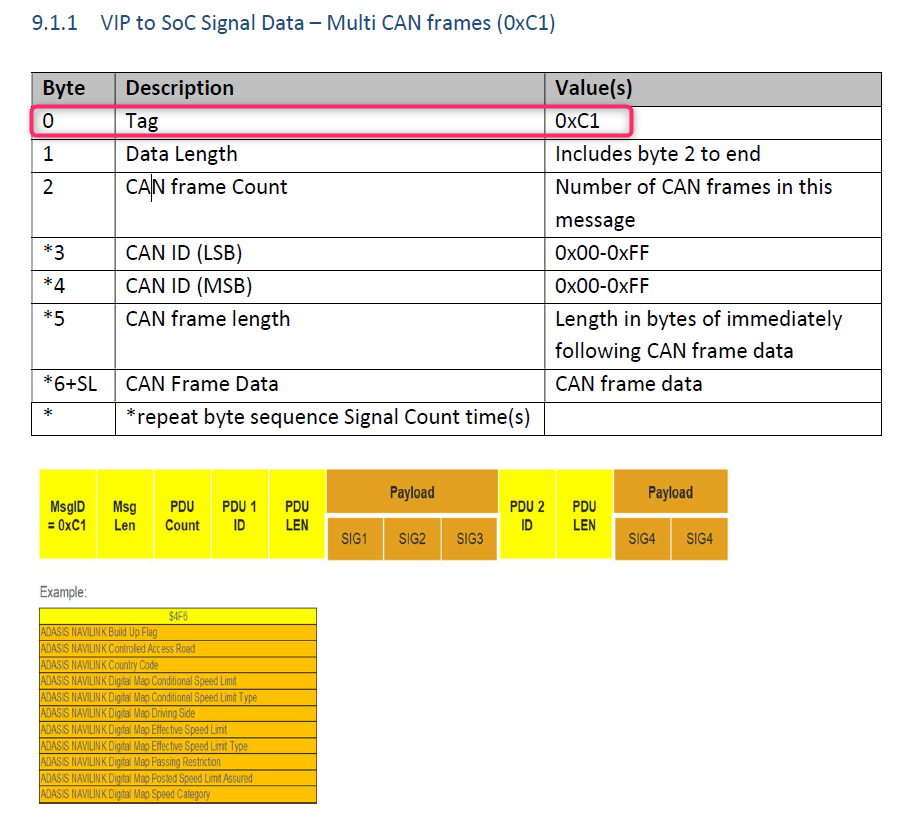
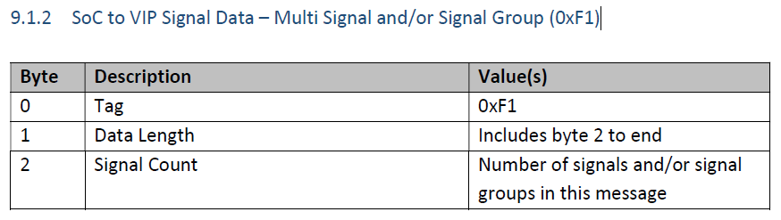
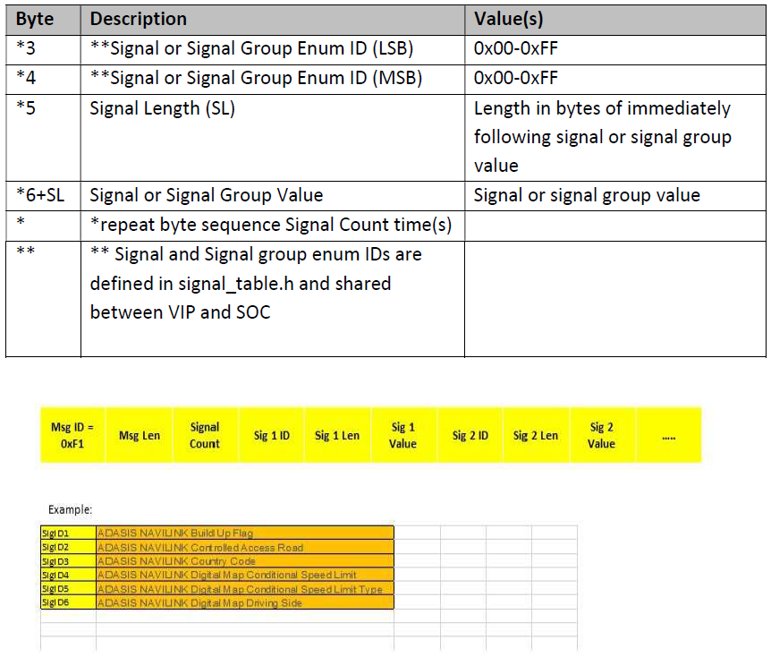
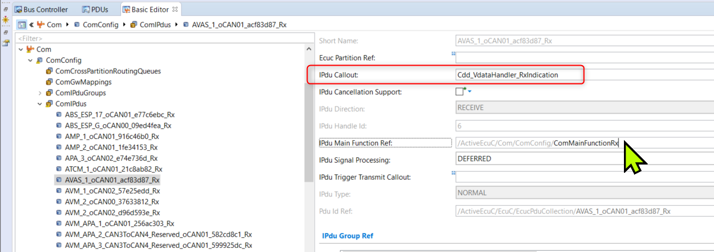
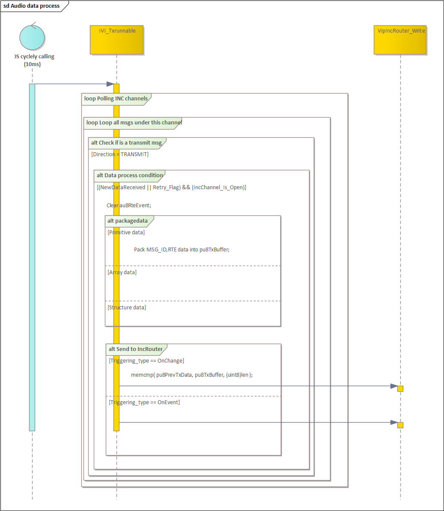
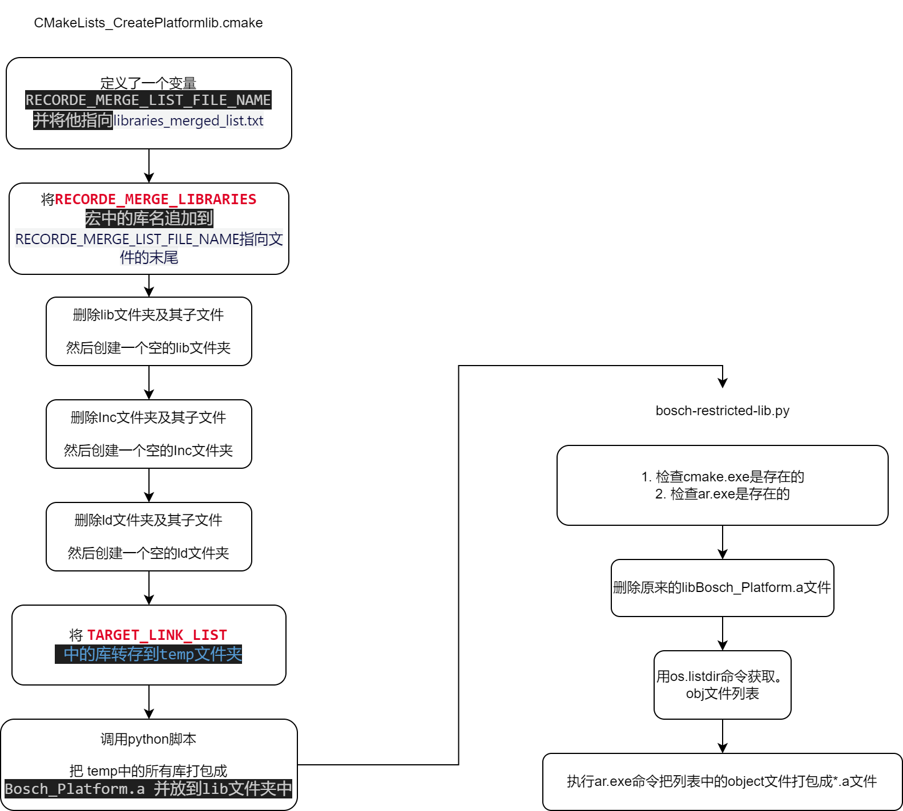
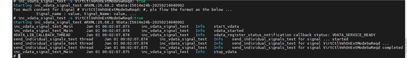
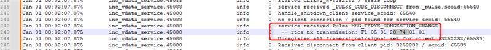

# SWC_INFO_CDD_VDATA_Handler_SRC

> Source: /spaces/CARSFW/pages/4564545919/SWC_INFO_CDD_VDATA_Handler_SRC
> Last modified: 2026-04-28T10:34:45.000+02:00

---

| 模块名称 | 作用 |  | 输入文件 | 输出文件 |
| --- | --- | --- | --- | --- |
| SWC_INFO_CDD_VDATA_Handler_SRC | COM和INC的数据转发服务 | python脚本生成 | VIP_CanIf_ecuc.arxml IVI_Vdata_Info.xlsx来自哪里？ |  |
| Signal Table Script脚本 | GB_ASR_CSM_155.arxml来自哪里？ GlobalA_LS_19_138.dbc | signal_table.h |
| SWC_INFO_CDD_IVIHandler_SRC | 为ODI_DATA，Audio,Brightness等11个INC通道的数据提供转发服务 | python脚本生成 | IVI_Vdata_Info.xlsx |  |
| SWC_INFO_CDD_VipIncRouter_SRC | 增加了MCU侧的flow control服务 |  |  |  |
| SWC_SignalDispatcher_SRC | 特殊信号的接收和发送 |  |  |  |

泛亚提供的文档链接：

Local_8155 - All Documents (bosch.com)

SGM Local 8155 - 01_System - All Documents (bosch.com)

COM需要为所有接收的IPDU配置callout： Cdd_VdataHandler_RxIndication

与SUM、NvM使用全部是RTE接口，与COM全部直接使用com_sendsignal().

VDATA测试命令:

信号下发指令

inc_vdata_signal_test -s VirtCtlVehOnExtModeSwReqd:true

7420 表示 VirtCtlVehOnExtModeSwReqd 下发给了 INCRouter

看 log 得指令

slog2info |grep vdata

实时抓 log

slog2info -W |grep vdata

inc_vdata_signal_test -t 10 -r ACCAct376

#### 1.1.1. 8155Vcuplus Tool.VdataScripts python脚本解析

1.WINDOW 批处理文件的执行步骤

2. WINDOW 批处理文件的简介

2.1. 执行 VdataIVIInfoExcelGen.bat 的目的

根据 input 文件路径下的输入文件 DBC ARXML ， MAC CSV 文件， Com_Cfg.h ， IVI_Vdata_Info.xlsx ；更新 input 路径下 IVI_Vdata_Info.xlsx 中两个子表‘ Tx_Signal_EnumID_Database ’和‘ Tx_Signal_Group_EnumID_Database ’最为输出；

|   |   |   |
| --- | --- | --- |
| 脚本文件 | 输入文件 | 输出文件 |
| VdataIVIInfoExcelGen.bat Export_ARXML_to_JSON.py Create_SignalList.py Vdata_IVI_Info_ExcelGen.py | input 文件路径下 : 1. Clea_Mode_Year23_VXM_Lite_V26.70.4_323_4B2fix.arxml 2. PATAC_MACT_Firewall_V26.68.3.csv 3. IVI_Vdata_Info.xlsx 4. Com_Cfg.h | IVI_Vdata_Info.xls x 中两个子表 - ‘ Tx_Signal_EnumID_Database ’和‘ Tx_Signal_Group_EnumID_Database ’ 注意点： IVI_Vdata_Info.xls x 输出路径即为输入路径（ input 文件下，目的是为了更新两个子表，信号和信号组枚举 ID 需要按照原有的 signaltable 表规则手动更新，作为 VdataInfoExcelGen.bat 文件的输入； |
|  |  |  |

2.2 执行 VdataInfoExcelGen.bat 的目的

根据 input 文件路径下的输入文件 DBC ARXML ， MAC CSV 文件， Com_Cfg.h ， IVI_Vdata_Info.xlsx ；复制 input 文件路径下的 IVI_Vdata_Info.xlsx 到 Gendata 路径下 IVI_Vdata_Info.xlsx ；生成更新 Gendata 路径下 IVI_Vdata_Info.xlsx

|   |   |   |
| --- | --- | --- |
| 脚本文件 | 输入文件 | 输出文件 |
| VdataInfoExcelGen.bat Export_ARXML_to_JSON.py Create_SignalList.py VdataInfoExcelGen.py | input 文件路径下 : 1. Clea_Mode_Year23_VXM_Lite_V26.70.4_323_4B2fix.arxml 2. PATAC_MACT_Firewall_V26.68.3.csv 3. IVI_Vdata_Info.xlsx 4. Com_Cfg.h | Gendata 路径下： 1. Clea_Mode_Year23_VXM_Lite_V26.72.4fixbootmode.arxml.json 2. Clea_Mode_Year23_VXM_Lite_V26.72.4fixbootmode.arxml.json.xlsx 3. IVI_Vdata_Info.xlsx 4. IVI_Vdata_Info.xlsx.bak 5. Tx_Signal_EnumID_Database.csv 6. Tx_Signal_Group_EnumID_Database.csv 7. VData_SOCtoVIP.csv |
|  |  |  |

2.3. 执行 VdataCddandSignalTableGen.bat 的目的

根据 input 文件路径下的输入文件 conv-mvp_CanIf_ecuc.arxml ， IVI_Vdata_Info_0630_Ver704.xlsx ， Gendata 路径下‘ IVI_Vdata_Info.xlsx ’

，生成 Cdd_VdataHandler_cfg.c 和 Cdd_VdataHandler_cfg.h ， signal_table.h

|   |   |   |
| --- | --- | --- |
| 脚本文件 | 输入文件 | 输出文件 |
| VdataCddandSignalTableGen.bat VdataCddCfgGen.py SignalTableGen.py | input 文件路径下 : 1.conv-mvp_CanIf_ecuc.arxml 2.IVI_Vdata_Info_0630_Ver704.xlsx Gendata 路径下 : 3. IVI_Vdata_Info.xlsx | Cdd_VdataHandler_cfg.c Cdd_VdataHandler_cfg.h signal_table.h |
|  |  |  |

2.4. 执行 VdataComCalloutArxmlGen.bat 的目的

根据 input 文件路径下的输入文件 conv-mvp_Com_ecuc.arxml ， IVI_Vdata_Info_0630_Ver704.xlsx ， output 路径下‘ conv-mvp_Com_ecuc.arxml, 创新更新所需的 RX  IPDU CBK.

|   |   |   |
| --- | --- | --- |
| 脚本文件 | 输入文件 | 输出文件 |
| VdataComCalloutArxmlGen.bat UpdataCOM_CFG.py | input 文件路径下 : conv-mvp_Com_ecuc.arxml IVI_Vdata_Info_0630_Ver704.xlsx | output 文件路径下： conv-mvp_Com_ecuc.arxml |
|  |  |  |

