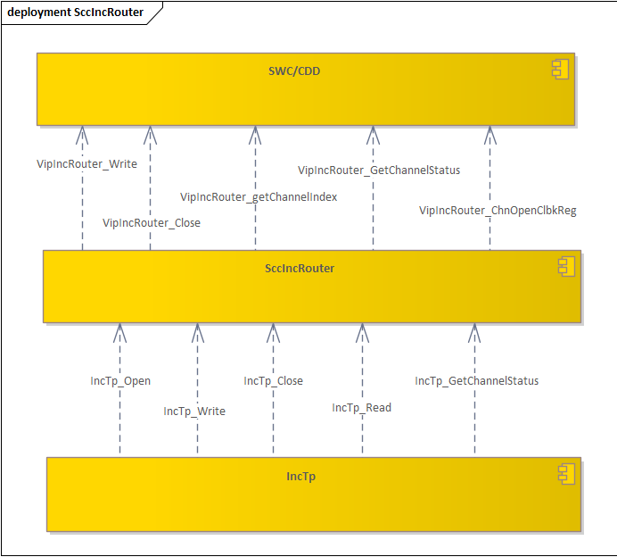
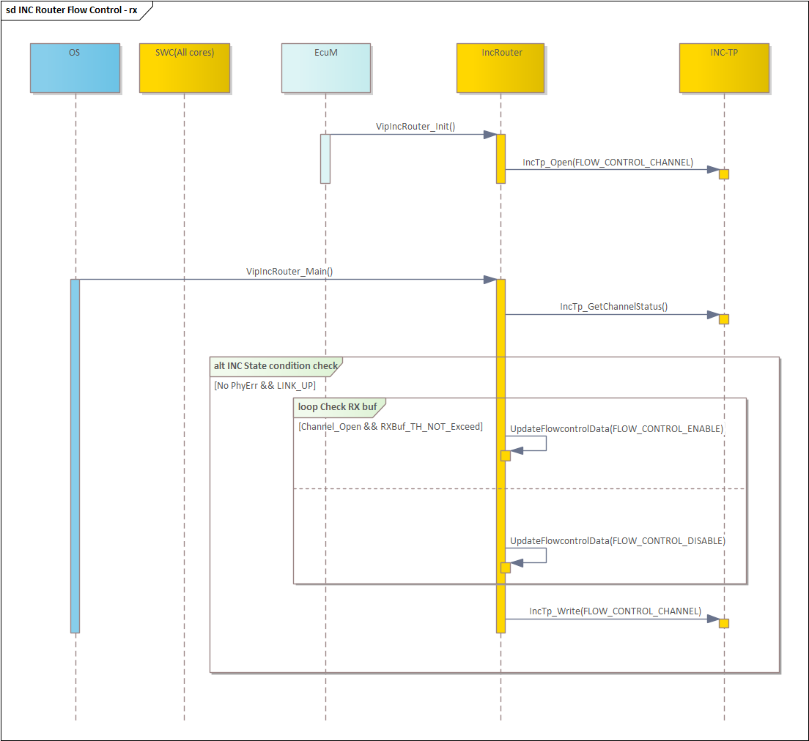
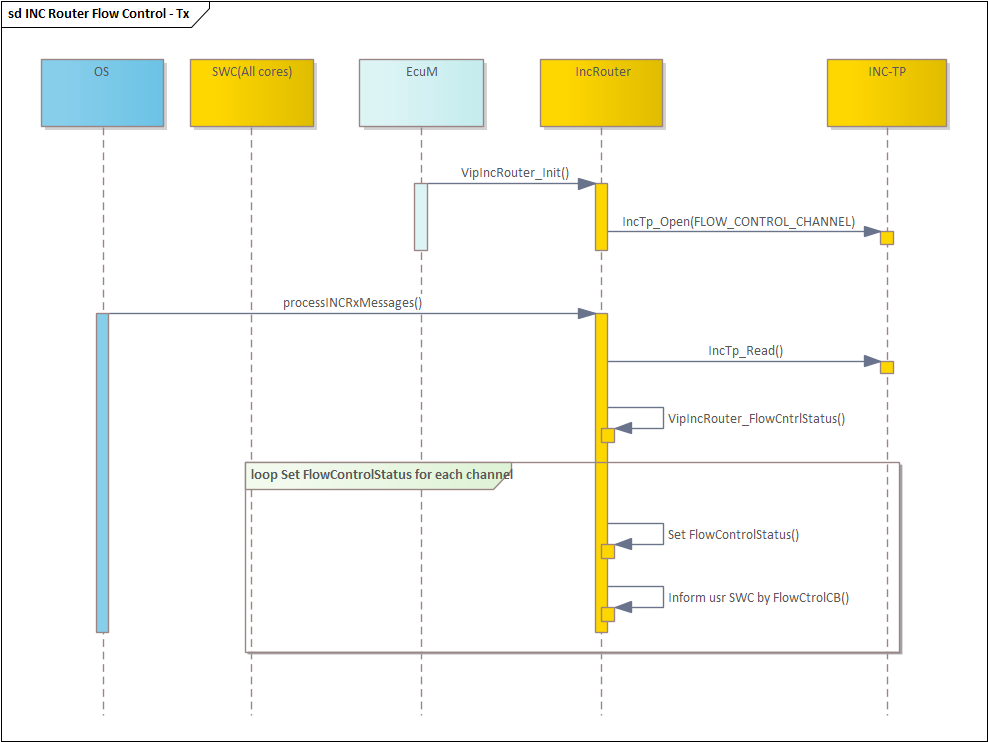
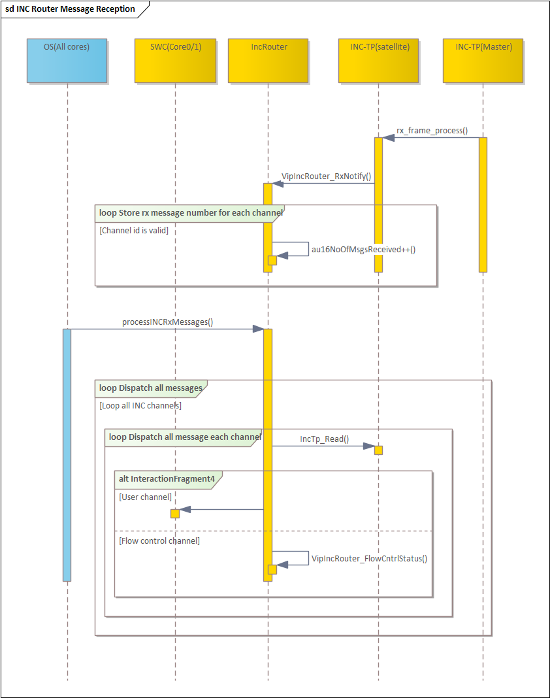
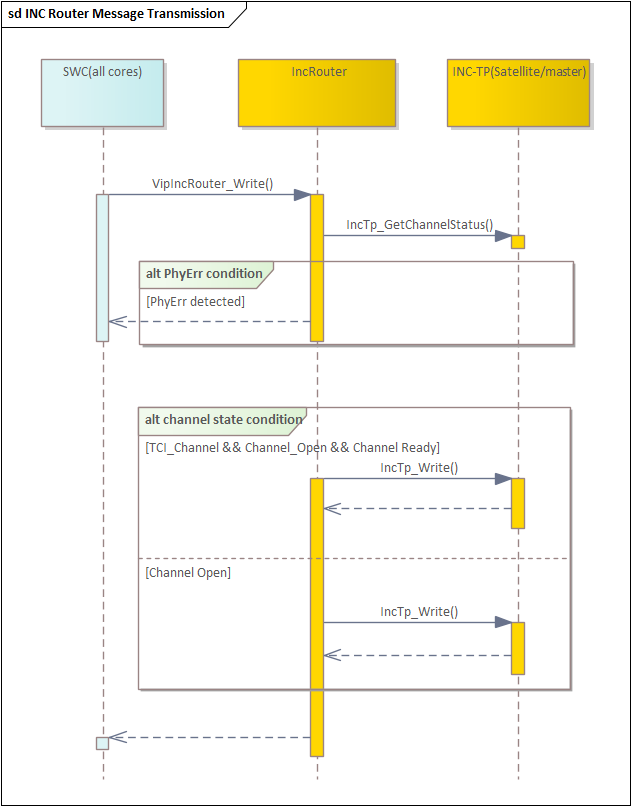

# SWC_INFO_CDD_VipIncRouter_SRC

> Source: /spaces/CARSFW/pages/4642136630/SWC_INFO_CDD_VipIncRouter_SRC
> Last modified: 2024-08-27T10:27:24.000+02:00

---

## 1. Relationship with other SWC

## 2. Flow Control feature

- Flow control can avoid INC channel rx buffer full, to prevent user data lost.
- MCU will monitor user channel rx ring buffer state, If it higher than 80%, inform APP on Soc to stop send data.
- MCU will received flow control message from Soc, to inform user SWC that stop transmit user data.

### 2.1. MCU control rx ring buffer

### 2.2. MCU will receive flow control message to inform SWC

|   |   |   |
| --- | --- | --- |
| Function name | void IncTp_GetChannelStatus(uint8 channelNumber, uint8* channelStatus) |  |
| Parameters (in): | channelNumber: INC channel number used by your component |  |
| Parameters (in-out): | None |  |
| Parameters (out): | channelStatus: | Bit0: 1: Open: it has been registered 0: closed |
| Bit2: 1: Tx frame resend failed, report PhyErr to User 0: No PhyErr. |
| Bit3: 1: RxBuffer_Th_Exceed (80%) 0: RxBuffer_Th_Not_Exceed |
| Bit4: 1: Both SPIs are LINK_UP 0: At least one SPI is LINK_DOWN |
| Bit5: 1: TxBuffer_Th_Exceed (80%) 0: TxBuffer_Th_Not_Exceed |
| Return value: | E_OK: Data is read successful. E_NOT_OK: read failed. |  |
| Description | This interface is called to get status of a channel |  |

## 3. Message Transmit and reception

### 3.1. Message reception

### 3.2. Message Transmission

