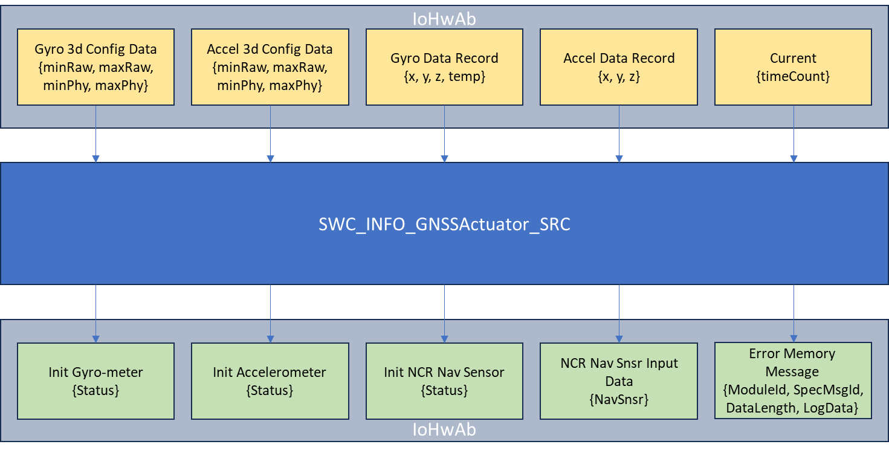

# SWC_INFO_GNSSActuator_SRC

> Source: /spaces/CARSFW/pages/4593454665/SWC_INFO_GNSSActuator_SRC
> Last modified: 2024-08-20T08:47:41.000+02:00

---

Overall, this module achieves access to Accel sensors and Gyro sensors through interface functions in IoHwAb.c. Including the status and data reading of Accel and Gyro sensors, as well as input data settings in Non-Conneted Regions from CAN. And auxiliary functions for recording error memory data and obtaining millisecond level time.

| Index | Source Code | Function List | Comment |
| --- | --- | --- | --- |
| 1 | navigation_errormemorywrite.h | 1. Navigation_ErrorMemoryWrite | 1. Function declaration: void Navigation_ErrorMemoryWrite(uint16 ModuleId , uint16 ModuleSpecMsgId, uint8 LogDataLength, uint8 *LogData , Std_ReturnType *ReturnType ); |
| 2 | navigation_errormemorywrite_m.c | 1. Navigation_ErrorMemoryWrite | 1. Function definition, call IoHwAb_ErrorMemory_WriteMessage, to print the received value in error memory log. |
| 3 | navigation_gettimestamp.h | 1. Navigation_GetTimeStamp | 1. Function declaration: void Navigation_GetTimeStamp(uint32 *timestamp_nav ); |
| 4 | navigation_gettimestamp_m.c | 1. Navigation_GetTimeStamp | 1. Function definition, call GetHWIO_t_Current, to get time of milliseconds. |
| 5 | navigation_setncrnavsnsrinputdata.h | 1. Navigation_SetNCRNavSnsrInputData | 1. Function declaration: void Navigation_SetNCRNavSnsrInputData(TsNCRNav_Input *NavSnsr ); |
| 6 | navigation_setncrnavsnsrinputdata_m.c | 1. Navigation_SetNCRNavSnsrInputData | 1. Function definition, call IoHwAb_SetNCRNavSnsrInputData, to set the required input data from CAN onto sensor connected to VIP in case of Non-Connected Regions. |
| 7 | navsensoravail_isaccelpresent.h | 1. NavSensorAvail_IsAccelPresent | 1. Function declaration: void NavSensorAvail_IsAccelPresent(TeNavMdlInitStatus *accelSnsrStatus ); |
| 8 | navsensoravail_isaccelpresent_m.c | 1. NavSensorAvail_IsAccelPresent | 1. Function definition, call IoHwAb_InitAccelerometer, to get the status initialization of Accelerometer sensor |
| 9 | navsensoravail_isgyropresent.h | 1. NavSensorAvail_IsGyroPresent | 1. Function declaration: void NavSensorAvail_IsGyroPresent(TeNavMdlInitStatus *gyroSnsrStatus ); |
| 10 | navsensoravail_isgyropresent_m.c | 1. NavSensorAvail_IsGyroPresent | 1. Function definition, call IoHwAb_InitGyrometer, to get the initialization status of Gyro sensor |
| 11 | navsensoravail_isncrsenspresent.h | 1. NavSensorAvail_IsNCRSensPresent | 1. Function declaration: void NavSensorAvail_IsNCRSensPresent(TeNavMdlInitStatus *Status ); |
| 12 | navsensoravail_isncrsenspresent_m.c | 1. NavSensorAvail_IsNCRSensPresent | 1. Function definition, call IoHwAb_InitNCR_NavSensor, to get the status initialization and availability of Ublox(?) module |
| 13 | readaccelgyro_acceldata.h | 1. ReadAccelGyro_AccelData | 1. Function declaration: void ReadAccelGyro_AccelData(s16 *ax , s16 *ay , s16 *az ); |
| 14 | readaccelgyro_acceldata_m.c | 1. ReadAccelGyro_AccelData | 1. Function definition, call IoHwAb_AccelDataRecord, to get the x, y, z axis values from Accelerometer sensor. |
| 15 | readaccelgyro_acceldynconfig.h | 1. ReadAccelGyro_AccelDynConfig | 1. Function declaration: void ReadAccelGyro_AccelDynConfig( s32 * aminraw, s32 * amaxraw, s32 * aminphy, s32 * amaxphy, Std_ReturnType * ReturnType ); |
| 16 | readaccelgyro_acceldynconfig_m.c | 1. ReadAccelGyro_AccelDynConfig | 1. Function definition, call IoHwAb_Accel3dConfigData, to get minimum raw value, maximum raw value, minimum physical and maximum physical as per the configuration of 3D Accelerometer sensor |
| 17 | readaccelgyro_gyrodata.h | 1. ReadAccelGyro_GyroData | 1. Function declaration: void ReadAccelGyro_GyroData(s16 *gx , s16 *gy , s16 *gz , s16 *gTemp ); |
| 18 | readaccelgyro_gyrodata_m.c | 1. ReadAccelGyro_GyroData | 1. Function definition, call IoHwAb_GyroDataRecord, to get the x, y, z axis and temperature values from Gyro sensor |
| 19 | readaccelgyro_gyrodynconfig.h | 1. ReadAccelGyro_GyroDynConfig | 1. Function declaration: void ReadAccelGyro_GyroDynConfig( s32 * gminraw, s32 * gmaxraw, s32 * gminphy, s32 * gmaxphy, Std_ReturnType * ReturnType ); |
| 20 | readaccelgyro_gyrodynconfig_m.c | 1. ReadAccelGyro_GyroDynConfig | 1. Function definition, call IoHwAb_Gyro3dConfigData, to get minimum raw value, maximum raw value, minimum physical and maximum physical as per the configuration of 3D Gyro sensor. |
| 21 | swc_info_gnssactuator_ar.h | 1. GetHWIO_t_Current_Client 2. IoHwAb_InitAccelerometer_Client 3. IoHwAb_InitGyrometer_Client 4. IoHwAb_InitNCR_NavSensor_Client 5. IoHwAb_AccelDataRecord_Client 6. IoHwAb_GyroDataRecord_Client 7. IoHwAb_SetNCRNavSnsrInputData_Client 8. IoHwAb_Gyro3dConfigData_Client 9. IoHwAb_Accel3dConfigData_Client 10. IoHwAb_ErrorMemory_WriteMessage_Client | 1. LOCAL_INLINE function, call Rte_Call_GetHWIO_t_Current_GetHWIO_t_Current, RTE interface with the same functionality as Navigation_GetTimeStamp 2. LOCAL_INLINE function, call Rte_Call_IoHwAb_InitAccelerometer_IoHwAb_InitAccelerometer, RTE interface with the same functionality as NavSensorAvail_IsAccelPresent 3. LOCAL_INLINE function, call Rte_Call_IoHwAb_InitGyrometer_IoHwAb_InitGyrometer, RTE interface with the same functionality as NavSensorAvail_IsGyroPresent 4. LOCAL_INLINE function, call Rte_Call_IoHwAb_InitNCR_NavSensor_IoHwAb_InitNCR_NavSensor, RTE interface with the same functionality as NavSensorAvail_IsNCRSensPresent 5. LOCAL_INLINE function, call Rte_Call_IoHwAb_AccelDataRecord_IoHwAb_AccelDataRecord, RTE interface with the same functionality as ReadAccelGyro_AccelData 6. LOCAL_INLINE function, call Rte_Call_IoHwAb_GyroDataRecord_IoHwAb_GyroDataRecord, RTE interface with the same functionality as ReadAccelGyro_GyroData 7. LOCAL_INLINE function, call Rte_Call_IoHwAb_SetNCRNavSnsrInputData_IoHwAb_SetNCRNavSnsrInputData, RTE interface with the same functionality as Navigation_SetNCRNavSnsrInputData 8. LOCAL_INLINE function, call Rte_Call_IoHwAb_Gyro3dConfigData_IoHwAb_Gyro3dConfigData, RTE interface with the same functionality as ReadAccelGyro_GyroDynConfig 9. LOCAL_INLINE function, call Rte_Call_IoHwAb_Accel3dConfigData_IoHwAb_Accel3dConfigData, RTE interface with the same functionality as ReadAccelGyro_AccelDynConfig 10. LOCAL_INLINE function, call Rte_Call_IoHwAb_ErrorMemory_WriteMessageReqC_IoHwAb_ErrorMemory_WriteMessage, RTE interface with the same functionality as Navigation_ErrorMemoryWrite |
| 22 | swc_info_gnssactuator_ta.h | - |  |

