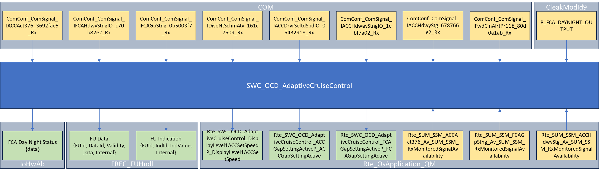
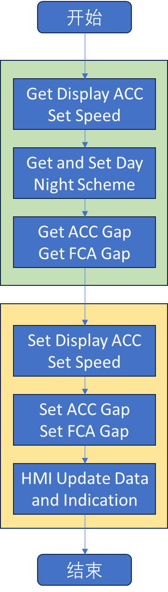

# SWC_OCD_AdaptiveCruiseControl

> Source: /spaces/CARSFW/pages/4593463413/SWC_OCD_AdaptiveCruiseControl
> Last modified: 2024-08-20T11:11:10.000+02:00

---

Overall, the module reads the Rte_SUM_SSM_XXX variable value and calls Com_ReceiveSignal interface to read ACC related signals through RTE interfaces. And set the human-machine interface through the FUHndl_vUpdateFUData and FUHndl_vUpdateFUIndication interfaces in the FREC_FUHndl.c file.

| Index | Source Code | Function List | Comment |
| --- | --- | --- | --- |
| 1 | AdaptiveCruiseControl.h | 1. AdaptiveCruiseControl_Initialize 2. AdaptiveCruiseControl_Startup 3. AdaptiveCruiseControl_Run 4. GetGapSetting | 1. Function declaration: void AdaptiveCruiseControl_Initialize( void ); 2. Function declaration: void AdaptiveCruiseControl_Startup( void ); 3. Function declaration: void AdaptiveCruiseControl_Run( void ); 4. Function declaration: uint8 GetGapSetting( void ); |
| 2 | AdaptiveCruiseControl.c | 1. AdaptiveCruiseControl_Initialize 2. AdaptiveCruiseControl_Startup 3. AdaptiveCruiseControl_Run 4. GetGapSetting | 1. Function definition, call PutFCANightSchemeOutput → IoHwAb_FCADayNightStatus(0), to set initial day night scheme. 2. This function has been commented out. 3. Function definition, call a series of functions, roughly divided into 3 steps. Step 1, set day night scheme status. Step 2, get the configuration status and signal values related to ACC. Step 3, update HMI. 4. Function definition, return variable g_u8GapSetting. |
| 3 | SWC_OCD_AdaptiveCruiseControl_ar.h | 1. HMIUpdateData_Client 2. HMIUpdateIndication_Client 3. GetACCAct 4. GetAdapCrsCnt_Av 5. GetFCAGpStng_Av 6. GetFCAHdwyStngIO 7. GetFCAGpStng 8. GetDispNtSchmAtv 9. GetACCDrvSeltdSpdIO 10. GetACCHdwayStngIO 11. GetACCHdwyStg 12. GetFwdCLnAlrtPr 13. ILGetACCHdwyStgFirstvalue 14. PutFCANightSchemeOutput 15. PutDisplayLevel1ACCSetSpeed 16. PutACCGapSettingActive 17. PutFCAGapSettingActive 18. GetP_FCA_DAYNIGHT_OUTPUT | 1. LOCAL_INLINE function, call Rte_Call_HMIC_HMIUpdateData → HMIUpdateData → FUHndl_vUpdateFUData in FREC_FUHndl.c, to SET HMI. 2. LOCAL_INLINE function, call Rte_Call_HMIC_HMIUpdateIndication → HMIUpdateIndication → FUHndl_vUpdateFUIndication in FREC_FUHndl.c, to SET HMI. 3. LOCAL_INLINE function, call Rte_Read_ACCAct376R_ACCAct376 → Rte_Read_SWC_OCD_AdaptiveCruiseControl_ACCAct376R_ACCAct376, to RECEIVE ComConf_ComSignal_IACCAct376_3692fae5_Rx by Com_ReceiveSignal interface. 4. LOCAL_INLINE function, call Rte_Read_AdapCrsCnt_AvR_AdapCrsCnt_Av → Rte_Read_SWC_OCD_AdaptiveCruiseControl_AdapCrsCnt_AvR_AdapCrsCnt_Av, to GET Rte_SUM_SSM_ACCAct376_Av_SUM_SSM_RxMonitoredSignalAvailability. 5. LOCAL_INLINE function, call Rte_Read_FCAGpStng_AvR_FCAGpStng_Av → Rte_Read_SWC_OCD_AdaptiveCruiseControl_FCAGpStng_AvR_FCAGpStng_Av, to GET Rte_SUM_SSM_FCAGpStng_Av_SUM_SSM_RxMonitoredSignalAvailability. 6. LOCAL_INLINE function, call Rte_Read_FCAHdwyStngIOR_FCAHdwyStngIO → Rte_Read_SWC_OCD_AdaptiveCruiseControl_FCAHdwyStngIOR_FCAHdwyStngIO, to RECEIVE ComConf_ComSignal_IFCAHdwyStngIO_c70b82e2_Rx by Com_ReceiveSignal interface. 7. LOCAL_INLINE function, call Rte_Read_FCAGpStngR_FCAGpStng → Rte_Read_SWC_OCD_AdaptiveCruiseControl_FCAGpStngR_FCAGpStng, to RECEIVE ComConf_ComSignal_IFCAGpStng_0b5003f7_Rx by Com_ReceiveSignal interface. 8. LOCAL_INLINE function, call Rte_Read_DispNtSchmAtvR_DispNtSchmAtv → Rte_Read_SWC_OCD_AdaptiveCruiseControl_DispNtSchmAtvR_DispNtSchmAtv, to RECEIVE ComConf_ComSignal_IDispNtSchmAtv_161c7509_Rx by Com_ReceiveSignal interface. 9. LOCAL_INLINE function, call Rte_Read_ACCDrvrSeltdSpdIOR_ACCDrvrSeltdSpdIO → Rte_Read_SWC_OCD_AdaptiveCruiseControl_ACCDrvrSeltdSpdIOR_ACCDrvrSeltdSpdIO, to RECEIVE ComConf_ComSignal_IACCDrvrSeltdSpdIO_05432918_Rx by Com_ReceiveSignal interface. 10. LOCAL_INLINE function, call Rte_Read_ACCHdwayStngIOR_ACCHdwayStngIO → Rte_Read_SWC_OCD_AdaptiveCruiseControl_ACCHdwayStngIOR_ACCHdwayStngIO, to RECEIVE ComConf_ComSignal_IACCHdwayStngIO_1ebf7a02_Rx by Com_ReceiveSignal interface. 11. LOCAL_INLINE function, call Rte_Read_ACCHdwyStgR_ACCHdwyStg → Rte_Read_SWC_OCD_AdaptiveCruiseControl_ACCHdwyStgR_ACCHdwyStg, to RECEIVE ComConf_ComSignal_IACCHdwyStg_678766e2_Rx by Com_ReceiveSignal interface. 12. LOCAL_INLINE function, call Rte_Read_FwdCLnAlrtPrR_FwdClnAlrtPr11E → Rte_Read_SWC_OCD_AdaptiveCruiseControl_FwdCLnAlrtPrR_FwdClnAlrtPr11E, to RECEIVE ComConf_ComSignal_IFwdClnAlrtPr11E_80d0a1ab_Rx by Com_ReceiveSignal interface. 13. LOCAL_INLINE function, call Rte_Read_ACCHdwyStg_AvR_ACCHdwyStg_Av → Rte_Read_SWC_OCD_AdaptiveCruiseControl_ACCHdwyStg_AvR_ACCHdwyStg_Av, to  GET Rte_SUM_SSM_ACCHdwyStg_Av_SUM_SSM_RxMonitoredSignalAvailability. 14. LOCAL_INLINE function, call Rte_Call_FCADayNightStatusOutputC_SetFCADayNightStatusOutput → IoHwAb_FCADayNightStatusOutputS → IoHwAb_FCADayNightStatus, to SET scheme Day or Night status. 15. Define function, call Rte_Write_DisplayLevel1ACCSetSpeedP_DisplayLevel1ACCSetSpeed → Rte_Write_SWC_OCD_AdaptiveCruiseControl_DisplayLevel1ACCSetSpeedP_DisplayLevel1ACCSetSpeed, to SET Rte_SWC_OCD_AdaptiveCruiseControl_DisplayLevel1ACCSetSpeedP_DisplayLevel1ACCSetSpeed. 16. Define function, call Rte_Write_ACCGapSettingActiveP_ACCGapSettingActive → Rte_Write_SWC_OCD_AdaptiveCruiseControl_ACCGapSettingActiveP_ACCGapSettingActive, to SET Rte_SWC_OCD_AdaptiveCruiseControl_ACCGapSettingActiveP_ACCGapSettingActive. 17. Define function, call Rte_Write_FCAGapSettingActiveP_FCAGapSettingActive → Rte_Write_SWC_OCD_AdaptiveCruiseControl_FCAGapSettingActiveP_FCAGapSettingActive, to SET Rte_SWC_OCD_AdaptiveCruiseControl_FCAGapSettingActiveP_FCAGapSettingActive. 18. Define function, GET P_FCA_DAYNIGHT_OUTPUT. |

Work flow of function AdaptiveCruiseControl_Run:

