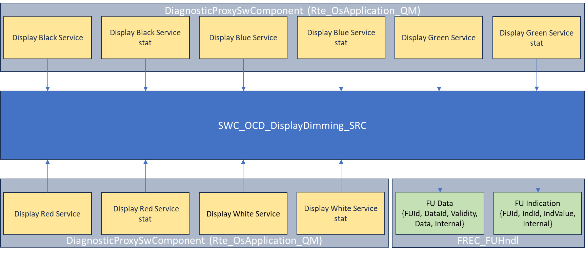
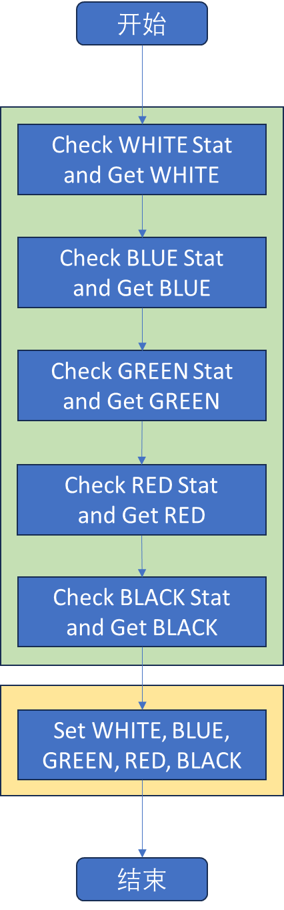

# SWC_OCD_DisplayDimming_SRC

> Source: /spaces/CARSFW/pages/4605626182/SWC_OCD_DisplayDimming_SRC
> Last modified: 2024-08-20T12:04:44.000+02:00

---

Overall, this module gets display dimming values, black, white and RGB from Rte_DiagnosticProxySwComponent, defined in Rte_OsApplication_QM.c, and then sets them through the human-machine interface function.

| Index | Source Code | Function List | Comment |
| --- | --- | --- | --- |
| 1 | displaydimming_run.h | 1. UpdateDisplayIllumination | 1. Function declaration: void UpdateDisplayIllumination(void); |
| 2 | displaydimming_run_m.c | 1. DisplayDimming_Run 2. UpdateDisplayIllumination | 1. Function definition, just call UpdateDisplayIllumination. 2. Function definition, call GetIlluminateCompleteDisplayCOLORService_IOC, to get display COLOR (white, blue, green, red, black), if GetIlluminateCompleteDisplayCOLORService_IOC_stat is TRUE. Then call HMIUpdateIndication to set display dimming color. |
| 3 | swc_ocd_displaydimming_ar.h | 1. GetIlluminateCompleteDisplayBlackService_IOC 2. GetIlluminateCompleteDisplayBlackService_IOC_stat 3. GetIlluminateCompleteDisplayBlueService_IOC 4. GetIlluminateCompleteDisplayBlueService_IOC_stat 5. GetIlluminateCompleteDisplayGreenService_IOC 6. GetIlluminateCompleteDisplayGreenService_IOC_stat 7. GetIlluminateCompleteDisplayRedService_IOC 8. GetIlluminateCompleteDisplayRedService_IOC_stat 9. GetIlluminateCompleteDisplayWhiteService_IOC 10. GetIlluminateCompleteDisplayWhiteService_IOC_stat 11. HMIUpdateData_Client 12. HMIUpdateIndication_Client | 1. LOCAL_INLINE function, call Rte_Read_IlluminateCompleteDisplayBlackService_IOCR_IlluminateCompleteDisplayBlackService_IOC → Rte_Read_SWC_OCD_DisplayDimming_IlluminateCompleteDisplayBlackService_IOCR_IlluminateCompleteDisplayBlackService_IOC, to GET Rte_DiagnosticProxySwComponent_IlluminateCompleteDisplayBlackService_IOCP_IlluminateCompleteDisplayBlackService_IOC. 2. LOCAL_INLINE function, call Rte_Read_IlluminateCompleteDisplayBlackService_IOC_statR_IlluminateCompleteDisplayBlackService_IOC_stat → Rte_Read_SWC_OCD_DisplayDimming_IlluminateCompleteDisplayBlackService_IOC_statR_IlluminateCompleteDisplayBlackService_IOC_stat, to GET Rte_DiagnosticProxySwComponent_IlluminateCompleteDisplayBlackService_IOC_statP_IlluminateCompleteDisplayBlackService_IOC_stat. 3. LOCAL_INLINE function, call Rte_Read_IlluminateCompleteDisplayBlueService_IOCR_IlluminateCompleteDisplayBlueService_IOC → Rte_Read_SWC_OCD_DisplayDimming_IlluminateCompleteDisplayBlueService_IOCR_IlluminateCompleteDisplayBlueService_IOC, to GET Rte_DiagnosticProxySwComponent_IlluminateCompleteDisplayBlueService_IOCP_IlluminateCompleteDisplayBlueService_IOC. 4. LOCAL_INLINE function, call Rte_Read_IlluminateCompleteDisplayBlueService_IOC_statR_IlluminateCompleteDisplayBlueService_IOC_stat → Rte_Read_SWC_OCD_DisplayDimming_IlluminateCompleteDisplayBlueService_IOC_statR_IlluminateCompleteDisplayBlueService_IOC_stat, to GET Rte_DiagnosticProxySwComponent_IlluminateCompleteDisplayBlueService_IOC_statP_IlluminateCompleteDisplayBlueService_IOC_stat. 5. LOCAL_INLINE function, call Rte_Read_IlluminateCompleteDisplayGreenService_IOCR_IlluminateCompleteDisplayGreenService_IOC → Rte_Read_SWC_OCD_DisplayDimming_IlluminateCompleteDisplayGreenService_IOCR_IlluminateCompleteDisplayGreenService_IOC, to GET Rte_DiagnosticProxySwComponent_IlluminateCompleteDisplayGreenService_IOCP_IlluminateCompleteDisplayGreenService_IOC. 6. LOCAL_INLINE function, call Rte_Read_IlluminateCompleteDisplayGreenService_IOC_statR_IlluminateCompleteDisplayGreenService_IOC_stat → Rte_Read_SWC_OCD_DisplayDimming_IlluminateCompleteDisplayGreenService_IOC_statR_IlluminateCompleteDisplayGreenService_IOC_stat, to GET Rte_DiagnosticProxySwComponent_IlluminateCompleteDisplayGreenService_IOC_statP_IlluminateCompleteDisplayGreenService_IOC_stat. 7. LOCAL_INLINE function, call Rte_Read_IlluminateCompleteDisplayRedService_IOCR_IlluminateCompleteDisplayRedService_IOC → Rte_Read_SWC_OCD_DisplayDimming_IlluminateCompleteDisplayRedService_IOCR_IlluminateCompleteDisplayRedService_IOC, to GET Rte_DiagnosticProxySwComponent_IlluminateCompleteDisplayRedService_IOCP_IlluminateCompleteDisplayRedService_IOC. 8. LOCAL_INLINE function, call Rte_Read_IlluminateCompleteDisplayRedService_IOC_statR_IlluminateCompleteDisplayRedService_IOC_stat → Rte_Read_SWC_OCD_DisplayDimming_IlluminateCompleteDisplayRedService_IOC_statR_IlluminateCompleteDisplayRedService_IOC_stat, to GET Rte_DiagnosticProxySwComponent_IlluminateCompleteDisplayRedService_IOC_statP_IlluminateCompleteDisplayRedService_IOC_stat. 9. LOCAL_INLINE function, call Rte_Read_IlluminateCompleteDisplayWhiteService_IOCR_IlluminateCompleteDisplayWhiteService_IOC → Rte_Read_SWC_OCD_DisplayDimming_IlluminateCompleteDisplayWhiteService_IOCR_IlluminateCompleteDisplayWhiteService_IOC, to GET Rte_DiagnosticProxySwComponent_IlluminateCompleteDisplayWhiteService_IOCP_IlluminateCompleteDisplayWhiteService_IOC. 10. LOCAL_INLINE function, call Rte_Read_IlluminateCompleteDisplayWhiteService_IOC_statR_IlluminateCompleteDisplayWhiteService_IOC_stat → Rte_Read_SWC_OCD_DisplayDimming_IlluminateCompleteDisplayWhiteService_IOC_statR_IlluminateCompleteDisplayWhiteService_IOC_stat, to GET Rte_DiagnosticProxySwComponent_IlluminateCompleteDisplayWhiteService_IOC_statP_IlluminateCompleteDisplayWhiteService_IOC_stat. 11. LOCAL_INLINE function, call Rte_Call_HMIC_HMIUpdateData → HMIUpdateData → FUHndl_vUpdateFUData in FREC_FUHndl.c, to SET HMI. 12. LOCAL_INLINE function, call Rte_Call_HMIC_HMIUpdateIndication → HMIUpdateIndication → FUHndl_vUpdateFUIndication in FREC_FUHndl.c, to SET HMI. |
| 4 | swc_ocd_displaydimming_ta.h | - |  |

Work flow of function DisplayDimming_Run:

