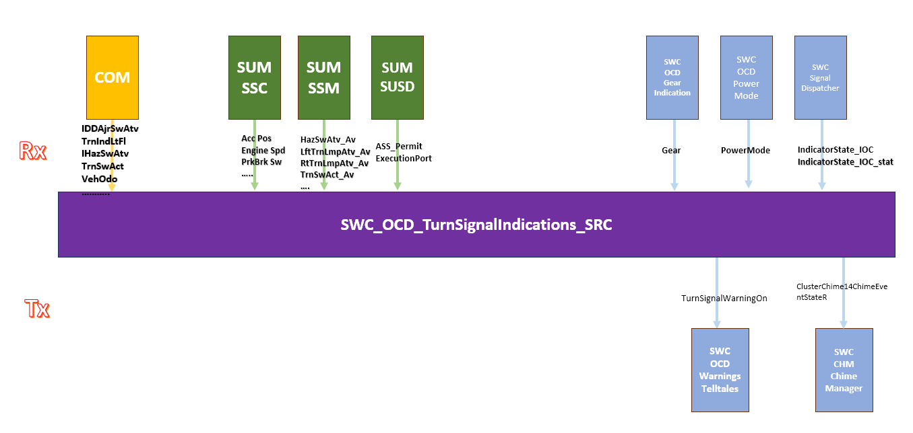

# SWC_OCD_TurnSignalIndications_SRC

> Source: /spaces/CARSFW/pages/4601800088/SWC_OCD_TurnSignalIndications_SRC
> Last modified: 2024-08-14T11:40:08.000+02:00

---

该模块控制左右转向灯得开关和声音得播放。

与此相关得功能有 左右转向灯开关、危险报警灯开关、驻车开启等。

需要计算闪烁时间、同步性、闪烁频率等。

|   |   |   |
| --- | --- | --- |
| LHT_ControlTurnSignalIndication.c |  |  |
|  | RtTrnLmpAtv_Clbk | 右转向灯计时开始，考虑危险报警灯开启得条件 |
|  | LftTrnLmpAtv_Clbk | 左转向灯计时开始，考虑危险报警灯开启得条件 |
|  | PrkLtRightIO_Clbk | 右转向灯计时开始，考虑驻车灯开启得条件 |
|  | PrkLtLeftIO_Cblk | 左转向灯计时开始，考虑驻车灯开启得条件 |
|  | HazSwAtv_Clbk | 危险报警灯控制左右转向灯开或者关 |
|  | TrnSwAct_Clbk | 获取转向灯开关状态 根据汽车里程等信息决定turn signal reminder timer状态 |
|  | IndicatorTurnSignalLeft_Delayed | 根据电源模式ACC RUN 或OFF前提下指示左转向灯得开启状态 |
|  | IndicatorTurnSignalLeft_Delayed | 根据电源模式ACC RUN 或OFF前提下指示右转向灯得开启状态 |
|  | TurnSignalIndicator | HMI: position 1:Left turn signal 2:Right turn signal On/Off: 1:on 2:off SoundOnOff: 0:no sound 1:sound |
|  | IsReminderActive | 1 active |
|  | UpdateReminderStatus |  |
|  | GetSound | Get Turn Indication sound |
|  | CheckTimeouts | Check for timeouts and if detected perform failsofting |
|  | HazardActivationCondition | Check for Off Powermode Hazard activation conditions |
|  | HazardOffModeTimer | Check for timer activit |
|  | evaluateLeftTurnChimeStatus | 控制chim时间，每次200ms清除chime timer或chime切换时响应 |
| main | TurnSignalIndications_Run | SUSD permission |
|  |  | 10ms task QM |
|  |  | 当转向灯得timer激活时判断是否超时并在计时完成后切换转向灯开启关闭状态 |
|  | TurnSignalIndications_Init |  |

