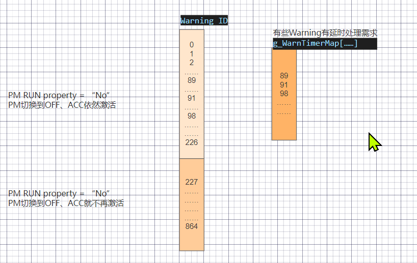
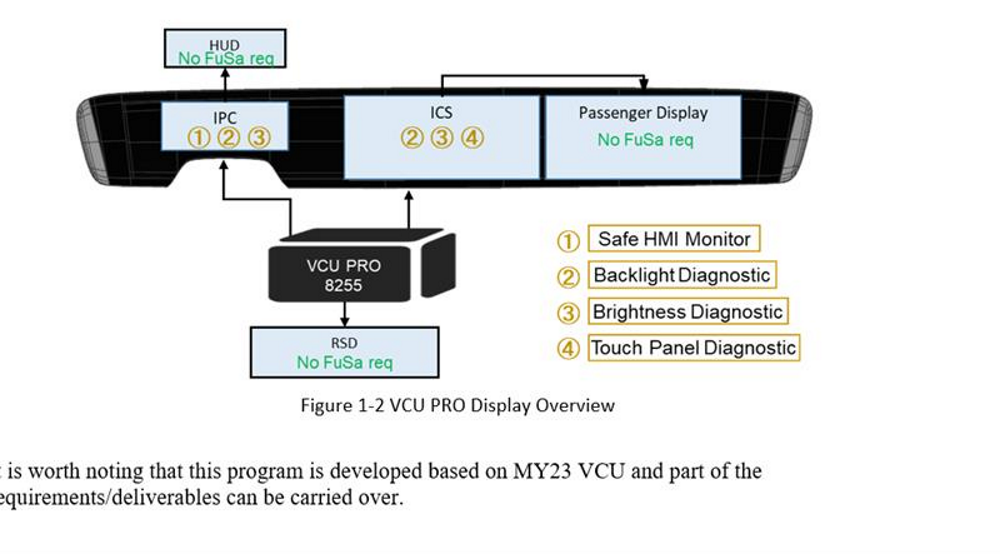
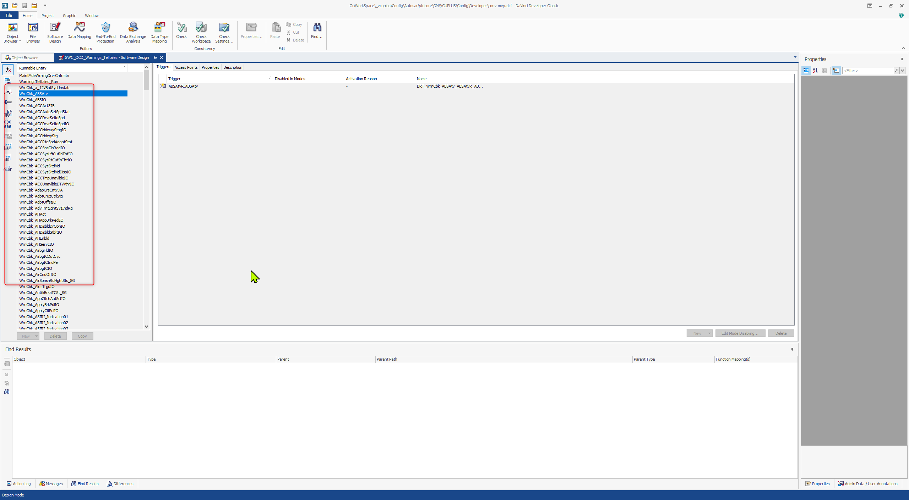
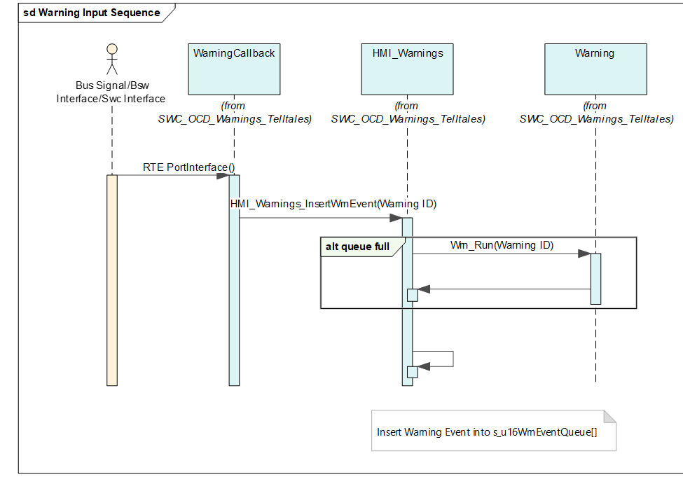
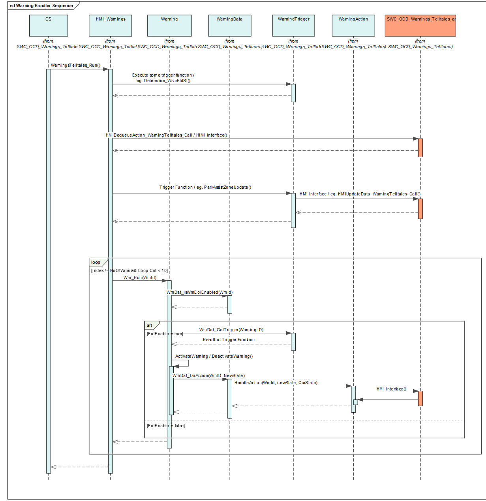
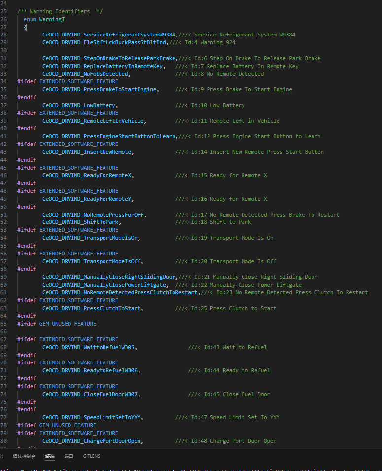
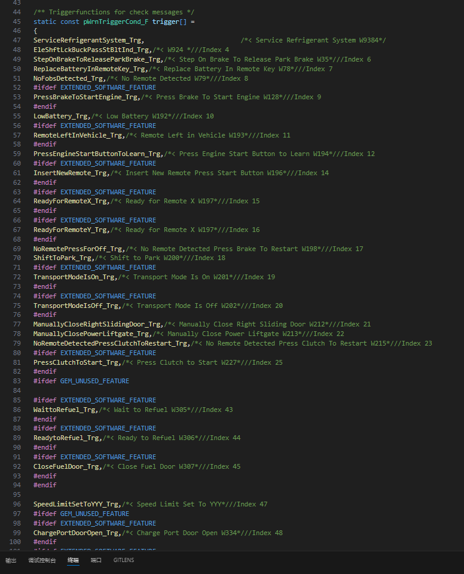
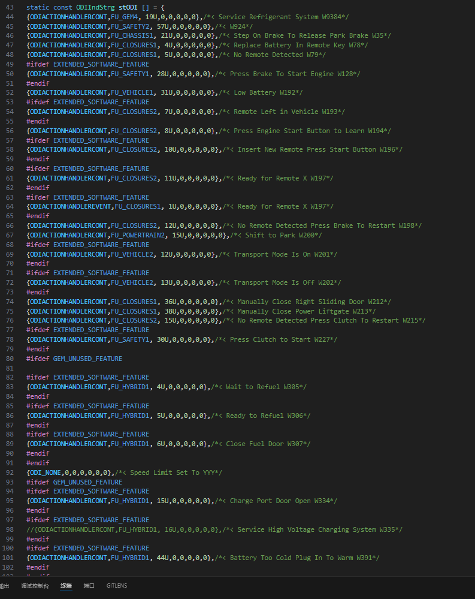
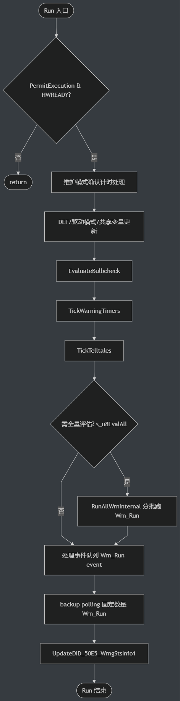

# SWC_OCD_Warnings_Telltales_SRC

> Source: /spaces/CARSFW/pages/4642135043/SWC_OCD_Warnings_Telltales_SRC
> Last modified: 2026-04-14T08:35:01.000+02:00

---

## 1. 概要：座舱系统的仪表侧支持一些提示类或报警类的信息展示，简称Warning，这些信息给与驾驶员指导性操作或提示故障及风险；

## 2. 需求文档：

```
PIS-2062 Cluster Telltale Requirement.docx
```

```
PIS-2047_EngineeringMode.docx
```

```
PIS-2076 Cluster General Requirement.docx
```

```
PIS-2085 IPC SW Specification V3.1.docx
```

```
……
```

```
Warning列表：PIS-2069 Cluster Warning Requirement(effect ICS&HUD).xlsx
```

（以客户最新为准）

## 3. 模块分析：

### 3.1. Warning集合介绍：

目前分析是两大类（有变更后续在补充）

第一类：根据电源状态控制，PM RUN Property = "Yes"，电源切换由RUN切换到ACC、OFF时，不再提示；

第二类：不受电源状态影响，PM RUN Property = "No"，电源切换到非RUN，也会判定提示；

还有个特殊的子集，某些Warning有延时处理的逻辑需求，有个单独的Mapping表，在周期性任务中会判定超时，再进一步处理；

代码中：用Warning ID的区间，进行了种类的区分；



非can总线信号触发的Warning：

CLEA部分：Warning #9601-9604

GB部分：Warning #8001 -8002 / Warning #8100+(GB L2++项目Only)

### 3.2. Warning提示种类：

|  |  |
| --- | --- |
| Chime音效 | Chime ID - 0 不需要触发Chime Chime ID - 具体数值标明Warning触发的Chime的ID |
| 显示在HUD | 抬头显示，此项紧CLEA适用？？ |
| 显示在IPC上 | 仪表 |
| 显示在ICS上 | 中控 |
|  |  |



### 3.3. Warning确认方式：

|  |  |
| --- | --- |
| Manual | 可以通过按键，手动确认消失 |
| ManualAuto | 可以通过按键确认消失，也可以超时确认消失 |
| Auto | 可以超时消失，但是不能手动确认消失 |
| NotAck | 既不能手动确认，也不能超时消失 |

### 3.4. 代码分析：

|  |  |
| --- | --- |
| HMI_Warnings.c HMI_Warnings.h | 周期执行WarningsTelltales_Run 1、处理Event输入 2、处理Warning的判定和结果执行 3、处理Timer |
| maintmdewrningdrvrcnfrmtn_m.c maintmdewrningdrvrcnfrmtn.h | FU218的一个功能实现 |
| NoActionChime.c | 取消Chime event |
| SWC_OCD_Warnings_Telltales_ar.h | 接口封装 |
| SWC_OCD_Warnings_telltales_Constants.h | 各种宏定义 |
| SWC_OCD_Warnings_telltales_Variables.c SWC_OCD_Warnings_telltales_Variables.h | 全局变量（此函数里多是Chime和功能的定时Timer） |
| Warning.c Warning.h | 主要Wrn_Run接口，实现对Warning的检测 |
| WarningAction.h WarningAction.c | 表stODI ---- 每个Warning对应的ODI配置 Warining对应的执行，发送HMI通知消息 |
| WarningCallback.c WarningCallback.h |  |
| WarningData.c WarningData.h | 表 WarningT ---- Warning Identifiers 表 trigger ---- Trigger functions for check messages |
| WarningTrigger.c WarningTrigger.h | Trigger functions的具体实现 |
|  |  |

SWC_OCD_Warnings_Telltal…

Warning触发输入分析：



Warning 处理分析：



重要的表：

表一：Warning ID

当收到或触发Warning后，设置Warning event时的Warning ID；



表二：Warning被触发后对应的功能接口函数



表三：Warning对应的ODI配置表；



-------------------------------------------------------------------------------------------------------------------------------------------------------------------------

add by mingzong, 对warning的补充




