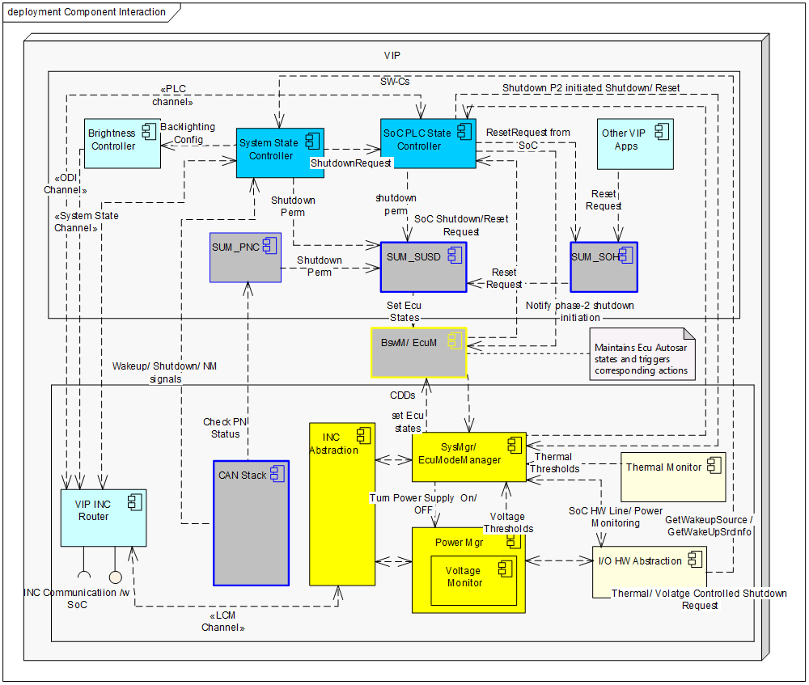
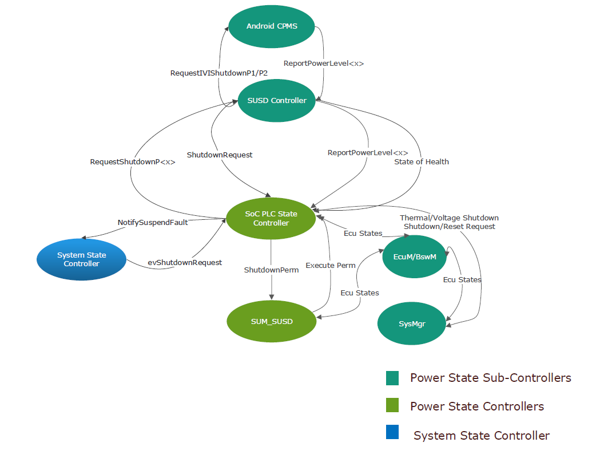
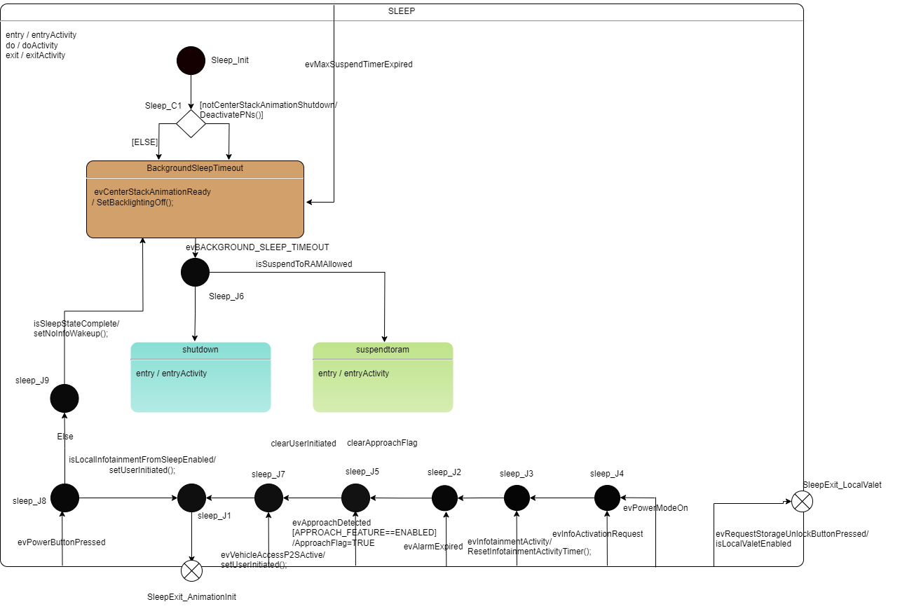
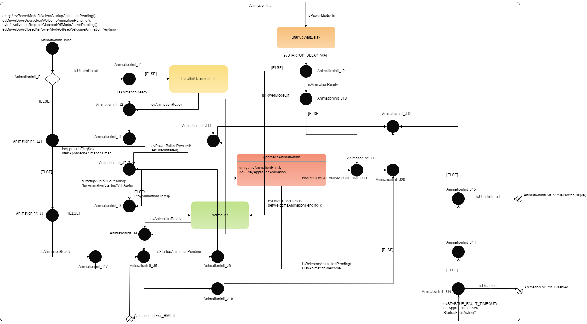
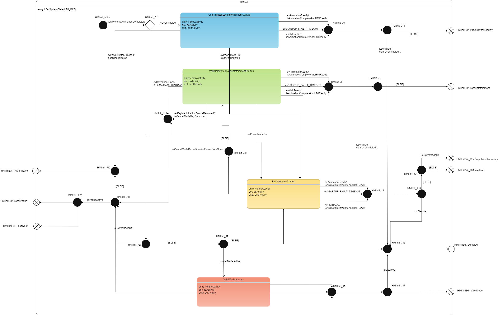
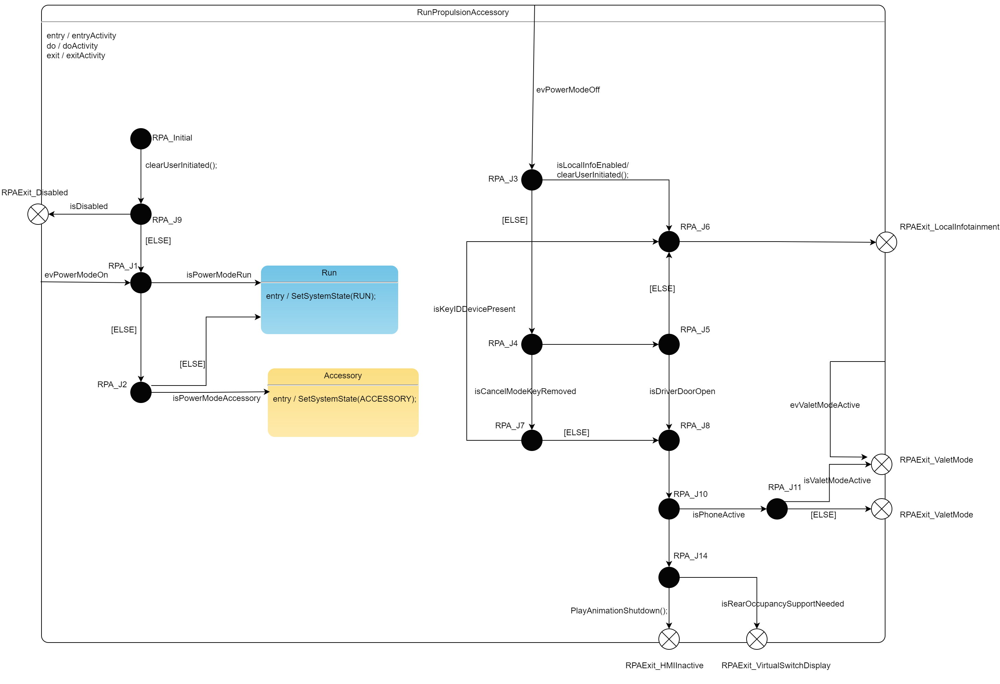
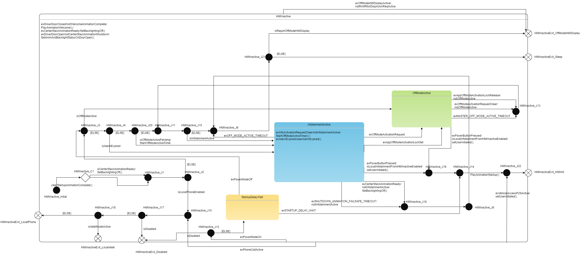
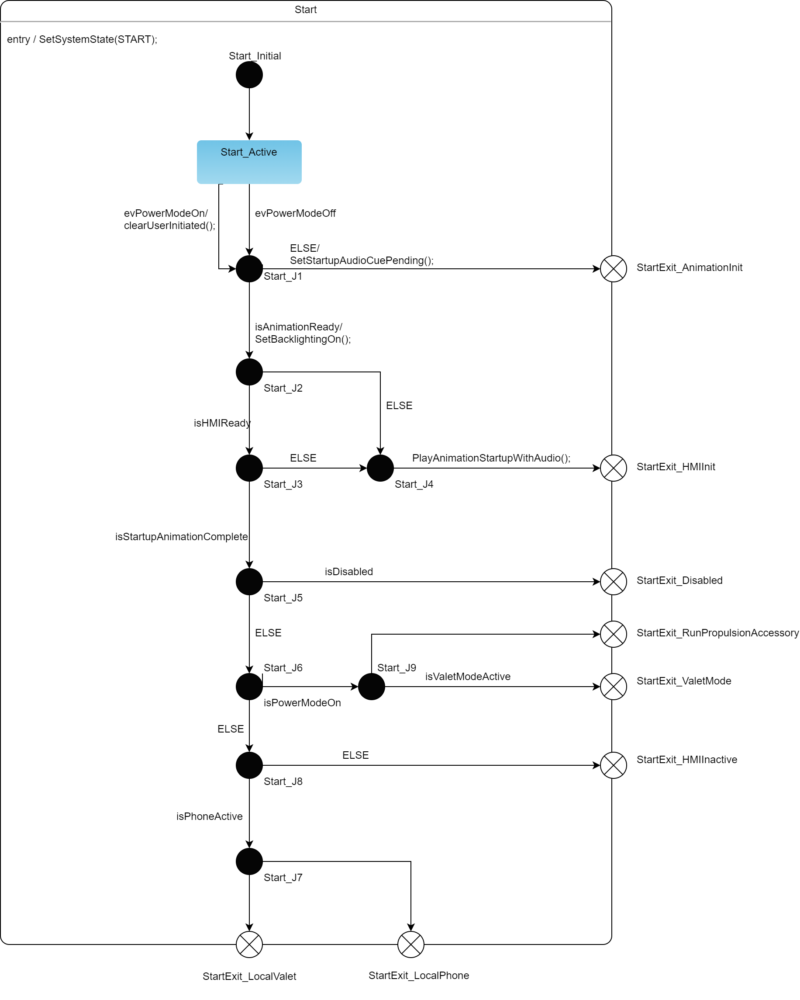
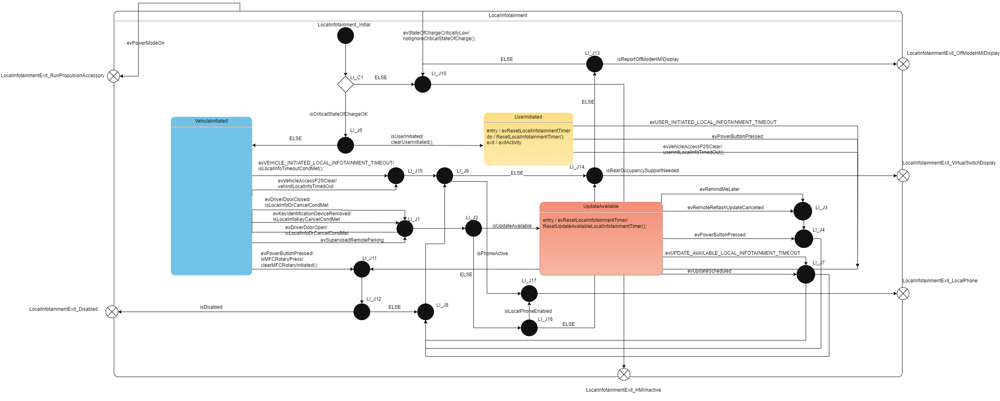

# SWC_INFO_SystemState_SRC

> Source: /spaces/CARSFW/pages/4581371837/SWC_INFO_SystemState_SRC
> Last modified: 2024-08-26T12:57:22.000+02:00

---

## 1. Introduction

The primary responsibility of the VCU power and system state management subsystem is to maintain the state of the VCU from two perspectives: - Various stages of Startup, Shutdown and Stable-State based on availability/loss of functionality during a power-cycle, called the Power-Life-Cycle (PLC) states . - Different stages in Startup, Shutdown and Stable-State maintenance that are visibly identifiable by the user (e.g. Animation display, HMI display), called the System States .

This module is the implementation of the System States.

## 2. Software Architecture

## 3. System State Controller States

|   |   |   |   |
| --- | --- | --- | --- |
| VCU System State | EUM | Description | Vehicle Power Mode |
| Sleep §  BackgroundSleepTimeout §  Shutdown §  SuspendToRAM | 0x00 | VCU睡眠状态 | OFF |
| AnimationInit §  NormalInit §  LocalInfotainmentInit §  StartupWaitDelay §  ApproachAnimationInit | 0x01 | 唤醒离开sleep后的动画初始化状态（approach动画也在此状态播放） | OFF |
| HMIInit §  FullOperationStartup §  ValetModeStartup §  VehicleInitiatedLocalInfotainmentStartup | 0x02 | 整车点火/上电后，QNX和安卓的HMI还未ready的状态 | ACC/RUN/PROPULSION |
| HMIInactive §  OffModeActive §  StartupDelayWait §  InfotainmentActive | 0x03 | 熄火后进入sleep之前的黑屏状态 | OFF |
| Start §  StartActive | 0x04 | 对应整车START/CRANK点火瞬间状态 | START |
| Run | 0x05 | 对应整车的RUN，此时VCU所有功能正常 | RUN |
| Propulsion | 0x06 | 对应整车PROPULSION，此时VCU所有功能正常 | PROPULSION |
| Accessory | 0x07 | 对应整车ACC，此时VCU所有功能正常 | ACC |
| VirtualSwitchDisplay §  VirtualSwitchDisplayActive | 0x12 | 允许用户在整车未点火/上电时进行车身等功能的快速控制 | OFF |
| LocalInfotainment §  UserInitiated §  VehicleInitiated §  UpdateAvailable | 0x08 | 整车熄火/下电后，允许娱乐系统继续使用的10分钟状态（类似RPA），此时VCU正常工作和显示 | OFF |
| LocalPhone §  IncomingCall §  CallActive §  ExtendedCall | 0x09 | 整车OFF状态下，VCU正在打电话时的状态 | OFF |
| Disabled §  TheftLocked §  NoVIN §  NoCalibration §  NoIVI |  | VCU发生theftlocked, NoIVI, NoVIN,NoCalibration时进入的状态 | ALL |
| RemoteReflashProgramming §  RemoteReflashProgrammingActive §  RemoteReflashProgrammingComplete | 0x10 | 安装OTA升级包或者USB升级时的状态 | OFF or RUN/PROPULSION |
| OffModeHMIDisplay §  OffModeHMIDisplay Active |  | 整车OFF情况下，应用有UI显示需求时可进入的状态 | OFF |

## 4. Code

the system state chart defined in system_state_statechart.h

We can use MACRO Expansion to get the statechart and transition tables.

MACRO_Expansion.c

## 5. Reference

- FG.04.03-Determine Infotainment System State.pdf
- SFS-107_VCU_System State and PLC state HLD_v3.2_ via Ritu Pande _ GM Confidential.pdf
- PIS-9006 System Power Management V0.0.0.5.docx
