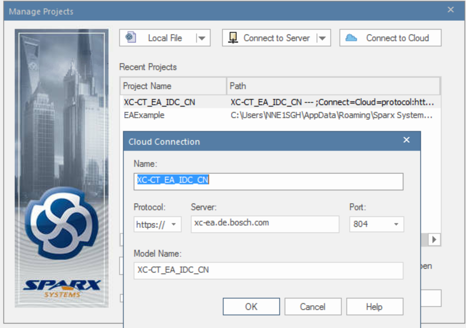
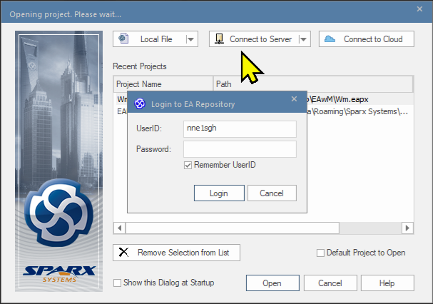

# SWCDD

> Source: /spaces/CARSFW/pages/3121660982/SWCDD
> Last modified: 2023-08-21T09:11:43.000+02:00

---

## Plan

| Modules | Responsible | Team |  | Internal Review Status | Internal Review Date | External Review | Move to TaiJi WiKi | Commets |
| --- | --- | --- | --- | --- | --- | --- | --- | --- |
| BM | NIU Newton (XC-CP/ESW2-CN) | ZEEKR |  | DONE | 28 Jun 2023 | 25 Jul 2023 | 26 Jul 2023 |  |
| FBL | WU Qi (XC-CP/ESW2-CN) LIU Hao (BCSC/ENG1) | ZEEKR |  | DONE | 07 Jul 2023 | 25 Jul 2023 | 28 Jul 2023 |  |
| cnconvbase |  |  |  |  |  |  |  |  |
| LCM (SCR + Thermal) | Jayaraj Praveen (BCSC/ENG1) ZHAO Joanna (XC-CP/ESW2-CN) TAN Shanhe (XC-CP/ESW2-CN) user-53e00 | BYD ZEEKR |  | DONE | 17 Jul 2023 18 Jul 2023 19 Jul 2023 | 03 Aug 2023 | 09 Aug 2023 | 30 Jun 2023 Check with praveen about the detail plan. Chapter Responsible Internal Review 2 Can 17-07-2023 5 Can 17-07-2023 6.1 Joanna 19 Jul 2023 6.2 Joanna 19 Jul 2023 7.1.1 Joanna 19 Jul 2023 7.1.2 - 7.1.4 Shanhe 18 Jul 2023 7.1.5 Can 17-07-2023 7.2.1-7.2.2 Joanna 19 Jul 2023 7.2.3 - 7.2.4 Shanhe 18 Jul 2023 7.2.6 Can 17-07-2023 7.2.7 Joanna 17-07-2023 7.2.8 Can 17-07-2023 7.2.9 Shanhe 18 Jul 2023 | Chapter | Responsible | Internal Review | 2 | Can | 17-07-2023 | 5 | Can | 17-07-2023 | 6.1 | Joanna | 19 Jul 2023 | 6.2 | Joanna | 19 Jul 2023 | 7.1.1 | Joanna | 19 Jul 2023 | 7.1.2 - 7.1.4 | Shanhe | 18 Jul 2023 | 7.1.5 | Can | 17-07-2023 | 7.2.1-7.2.2 | Joanna | 19 Jul 2023 | 7.2.3 - 7.2.4 | Shanhe | 18 Jul 2023 | 7.2.6 | Can | 17-07-2023 | 7.2.7 | Joanna | 17-07-2023 | 7.2.8 | Can | 17-07-2023 | 7.2.9 | Shanhe | 18 Jul 2023 |
| Chapter | Responsible | Internal Review |
| 2 | Can | 17-07-2023 |
| 5 | Can | 17-07-2023 |
| 6.1 | Joanna | 19 Jul 2023 |
| 6.2 | Joanna | 19 Jul 2023 |
| 7.1.1 | Joanna | 19 Jul 2023 |
| 7.1.2 - 7.1.4 | Shanhe | 18 Jul 2023 |
| 7.1.5 | Can | 17-07-2023 |
| 7.2.1-7.2.2 | Joanna | 19 Jul 2023 |
| 7.2.3 - 7.2.4 | Shanhe | 18 Jul 2023 |
| 7.2.6 | Can | 17-07-2023 |
| 7.2.7 | Joanna | 17-07-2023 |
| 7.2.8 | Can | 17-07-2023 |
| 7.2.9 | Shanhe | 18 Jul 2023 |
| Communication Stack | LI Minsheng (XC-CP/ESW2-CN) | ZEEKR |  | DONE | 24 Jul 2023 | 25 Jul 2023 | 28 Jul 2023 |  |
| Inc Stack | LI Minsheng (XC-CP/ESW2-CN) user-52101 | ZEEKR |  | DONE | 05 Jul 2023 | 25 Jul 2023 | 28 Jul 2023 |  |
| M2S | YU Xiaoyang (BCSC/ENG1) | ZEEKR |  | DONE | 24 Jul 2023 | 02 Aug 2023 | 09 Aug 2023 |  |
| S2M | YU Xiaoyang (BCSC/ENG1) | ZEEKR |  | DONE | 24 Jul 2023 | 02 Aug 2023 | 09 Aug 2023 |  |
| KDS | user-52101 | CHERY |  | DONE | 18 Jul 2023 | 02 Aug 2023 | 09 Aug 2023 | ECT has first version can be reference. How to write SWCDD - XC-CT China Convergence - Docupedia (bosch.com) Vijay Kumar B (MS/EKI-XC) |
| Variant Handler | LI Haixu (XC-CP/ESW2-CN) | CHERY |  | DONE | 13 Jul 2023 | 02 Aug 2023 | 09 Aug 2023 | ECT has first version can be reference. How to write SWCDD - XC-CT China Convergence - Docupedia (bosch.com) Vijay Kumar B (MS/EKI-XC) |
| RTC | JI Hongguang (XC-CP/ESW2-CN) | CHERY |  | DONE | 13 Jul 2023 | 02 Aug 2023 | 09 Aug 2023 | ECT has first version can be reference. How to write SWCDD - XC-CT China Convergence - Docupedia (bosch.com) Vijay Kumar B (MS/EKI-XC) |
| Audio | user-585ad | GAC |  | DONE | 18 Jul 2023 | 02 Aug 2023 | 09 Aug 2023 | ECT has first version can be reference. How to write SWCDD - XC-CT China Convergence - Docupedia (bosch.com) Vijay Kumar B (MS/EKI-XC) |
| DLT | TAN Shanhe (XC-CP/ESW2-CN) | ZEEKR |  |  |  |  |  | ECT has first version can be reference. How to write SWCDD - XC-CT China Convergence - Docupedia (bosch.com) Vijay Kumar B (MS/EKI-XC) |

## SWCDD

Swcdd is stored in On Driver. Link: SWCDD .

With in this folder, there are two parts:

- SWCDD_Autosar_TaiJiPF.docx: This is the file we will working on to write our SWCDD.
- Reference folder: Having some other team or other project SWCDDs for reference.

## Taiji Platform SWCDD Link:

[Taiji 1.0][SWCDD] Autosar - XC-CT China - Docupedia (bosch.com)

## EA

How to apply EA.

> **INFO: How to EA**
> How to get access permission and connect repo: https://inside-docupedia.bosch.com/confluence/display/OneCM/%5BEnterprise+Architect%5D+-+Access Please apply below idm role (base on your role in project) to give write permission: sns_ea_idc_cn_Architects sns_ea_idc_cn_Members With the new WebEA repo, there are two options to connect our models: Install Enterprise Architect client in PC and connect via cloud connection, refer to Establish a connection to a module in above link . Access your models in your browser, go to https://xc-ea.de.bosch.com/WebEA/login.php , and select XC-CT_EA_IDC_CN.

EA Cloud Information.

When you connect server and meet next issue.

Please request to add your UserId to EA server by email, next is an example.

RE_ New EA Floating Lice…
